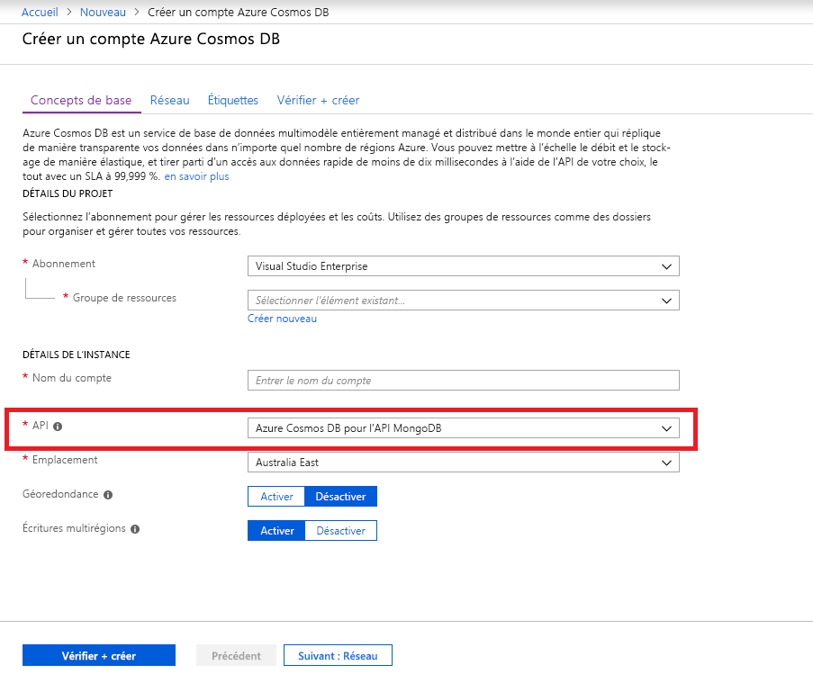
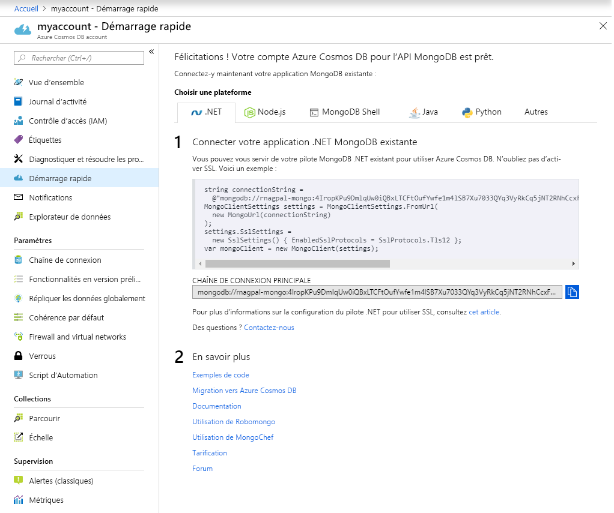

1. Dans une nouvelle fenêtre, connectez-vous au [portail Azure](https://portal.azure.com/).
2. Dans le menu de gauche, cliquez sur **Créer une ressource**, sur **Bases de données**, puis sous **Azure Cosmos DB**, cliquez sur **Créer**.
   
   

3. Dans la page **Créer un compte Azure Cosmos DB**, entrez les paramètres du nouveau compte Azure Cosmos DB. 
 
    Paramètre|Valeur|Description
    ---|---|---
    Abonnement|Votre abonnement|Sélectionnez l’abonnement Azure que vous souhaitez utiliser pour ce compte Azure Cosmos DB. 
    Groupe de ressources|Création  Entrez ensuite le même nom unique que celui fourni dans l’ID|Sélectionnez **Créer nouveau**. Entrez ensuite le nom du nouveau groupe de ressources pour votre compte. Pour rester simple, utilisez le même nom que celui de votre ID. 
    Nom du compte|Entrez un nom unique|Entrez un nom unique pour identifier votre compte Azure Cosmos DB. Étant donné que *documents.azure.com* est ajouté à l’ID que vous fournissez pour créer votre URI, utilisez un ID unique.  L’ID peut uniquement utiliser des lettres minuscules, des chiffres et le caractère de trait d’union (-). Il doit comprendre entre 3 et 31 caractères.
    API|API Cosmos DB pour MongoDB|L’API détermine le type de compte à créer. Azure Cosmos DB fournit cinq API : Core(SQL) pour les bases de données orientées document, Gremlin pour les bases de données de graphe, API Azure Cosmos DB pour MongoDB pour les bases de données de document, Table Azure et Cassandra. Actuellement, vous devez créer un compte distinct pour chaque API.   Sélectionnez **MongoDB** car ce guide de démarrage rapide vous permet de créer une table qui fonctionne avec l'API MongoDB.|
    Lieu|Sélectionner la région la plus proche de vos utilisateurs|Sélectionnez la zone géographique dans laquelle héberger votre compte Azure Cosmos DB. Utilisez l’emplacement le plus proche de vos utilisateurs, pour leur donner l’accès le plus rapide possible aux données.

    Sélectionnez **Vérifier + créer**. Vous pouvez ignorer les sections **Réseau** et **Balises**. 

    

4. La création du compte prend quelques minutes. Attendez que le portail affiche la page **Félicitations ! Votre compte Cosmos avec compatibilité de protocole de transmission pour MongoDB est prêt**.

    
