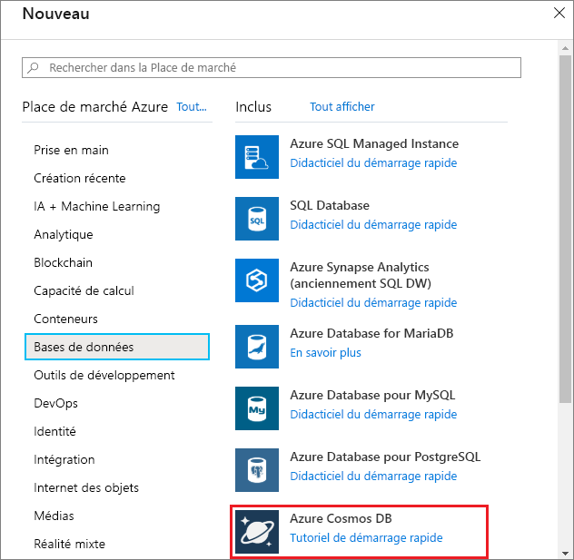
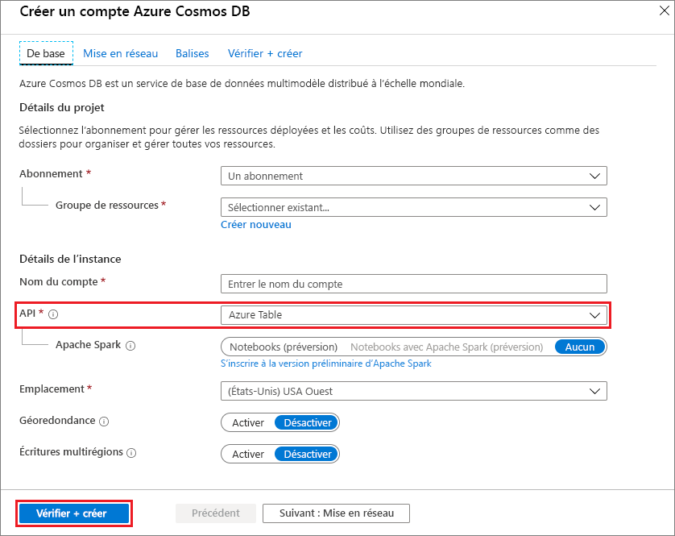

1. Dans une nouvelle fenêtre du navigateur, connectez-vous au [portail Azure](https://portal.azure.com/).
2. Dans le volet de navigation gauche, sélectionnez **Créer une ressource**. Sélectionnez **Bases de données**, puis **Azure Cosmos DB**.
   
   

3. Dans la page **Créer un compte Azure Cosmos DB**, entrez les paramètres du nouveau compte Azure Cosmos DB :
 
    Paramètre|Valeur|Description
    ---|---|---
    Abonnement|Votre abonnement|Sélectionnez l’abonnement Azure que vous souhaitez utiliser pour ce compte Azure Cosmos DB. 
    Groupe de ressources|Création  Entrez ensuite le même nom unique que celui fourni dans l’ID|Sélectionnez **Créer nouveau**. Entrez ensuite le nom du nouveau groupe de ressources pour votre compte. Pour rester simple, utilisez le même nom que celui de votre ID. 
    Nom du compte|Entrez un nom unique|Entrez un nom unique pour identifier votre compte Azure Cosmos DB.  L’ID peut uniquement utiliser des lettres minuscules, des chiffres et le caractère de trait d’union (-). Il doit comprendre entre 3 et 31 caractères.
    API|table Azure|L’API détermine le type de compte à créer. Azure Cosmos DB fournit cinq API : Core(SQL) pour les bases de données orientées document, Gremlin pour les bases de données de graphe, MongoDB pour les bases de données de document, Table Azure et Cassandra. Actuellement, vous devez créer un compte distinct pour chaque API.   Sélectionnez **Table Azure**, car ce guide de démarrage rapide vous permet de créer une table qui fonctionne avec l’API Table.   [Découvrez plus d’informations sur l’API Table](../articles/cosmos-db/table-introduction.md).|
    Lieu|Sélectionner la région la plus proche de vos utilisateurs|Sélectionnez la zone géographique dans laquelle héberger votre compte Azure Cosmos DB. Utilisez l’emplacement le plus proche de vos utilisateurs pour leur donner l’accès le plus rapide aux données.

    Vous pouvez laisser les options **Géoredondance** et **Écritures multirégions** avec leur valeur par défaut (**Désactiver**) pour éviter des frais d’unités de requête supplémentaires. Vous pouvez ignorer les sections **Réseau** et **Balises**.

5. Sélectionnez **Vérifier + créer**. Une fois la validation terminée, sélectionnez **Créer** pour créer le compte. 
 
   

6. La création du compte prend quelques minutes. Un message vous indique que **Votre déploiement est en cours**. Attendez la fin du déploiement, puis sélectionnez **Accéder à la ressource**.

    
