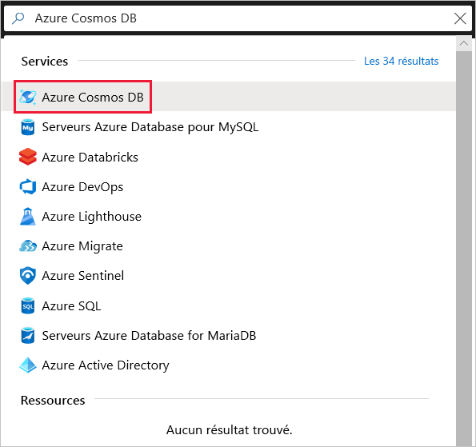
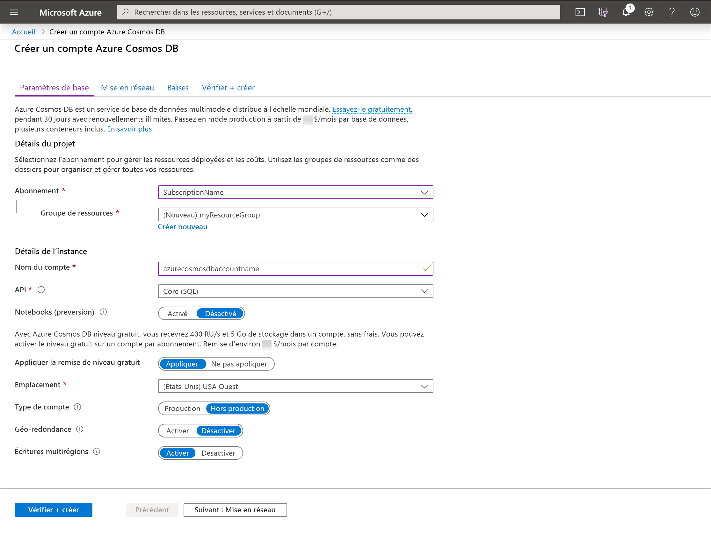
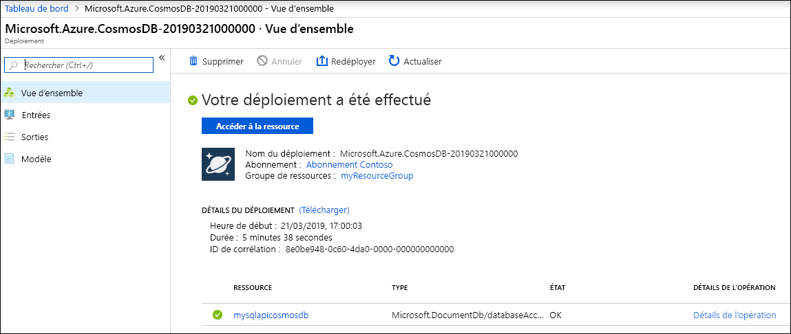

1. Accédez au [portail Azure](https://portal.azure.com/) pour créer un compte Azure Cosmos DB. Recherchez et sélectionnez **Azure Cosmos DB**.

   

1. Sélectionnez **Ajouter**.
1. Dans la page **Créer un compte Azure Cosmos DB**, entrez les paramètres de base du nouveau compte Azure Cosmos. 

    |Paramètre|Valeur|Description |
    |---|---|---|
    |Abonnement|Nom d’abonnement|Sélectionnez l’abonnement Azure à utiliser pour ce compte Azure Cosmos. |
    |Groupe de ressources|Nom de groupe ressources|Sélectionnez un groupe de ressources ou sélectionnez **Créer**, puis entrez un nom unique pour le nouveau groupe de ressources. |
    |Nom du compte|Un nom unique|Entrez un nom pour identifier votre compte Azure Cosmos. Étant donné que *documents.azure.com* est ajouté au nom que vous fournissez pour créer votre URI, utilisez un nom unique.  Le nom peut uniquement contenir des lettres minuscules, des chiffres et le caractère de trait d’union (-). Sa longueur doit être comprise entre 3 et 31 caractères.|
    |API|Type de compte à créer|Sélectionnez **Core (SQL)** pour créer une base de données orientée document et effectuez des requêtes à l’aide de la syntaxe SQL.   L’API détermine le type de compte à créer. Azure Cosmos DB fournit cinq API : Core (SQL) et MongoDB pour les données de document, Gremlin pour les données de graphe, Table Azure et Cassandra. Actuellement, vous devez créer un compte distinct pour chaque API.   [En savoir plus sur l’API SQL](../articles/cosmos-db/documentdb-introduction.md).|
    |Appliquer la remise de niveau gratuit|Appliquer ou ne pas appliquer|Avec Azure Cosmos DB niveau gratuit, vous recevrez 400 RU/s et 5 Go de stockage dans un compte, sans frais. Découvrez-en plus sur le [niveau gratuit](https://azure.microsoft.com/pricing/details/cosmos-db/).|
    |Emplacement|La région la plus proche de vos utilisateurs|Sélectionnez la zone géographique dans laquelle héberger votre compte Azure Cosmos DB. Utilisez l’emplacement le plus proche de vos utilisateurs pour leur donner l’accès le plus rapide possible aux données.|
    |Type de compte|Production ou non-production|Sélectionnez **Production** si le compte sera utilisé pour une charge de travail de production. Sélectionnez **Hors production** si le compte sera utilisé hors production, par exemple pour le développement, les tests, l’assurance qualité ou la préproduction. Il s’agit d’un paramètre d’étiquette de ressource Azure qui permet d’ajuster l’expérience du portail sans affecter le compte Azure Cosmos DB sous-jacent. Vous pouvez modifier cette valeur à tout moment.|

> [!NOTE]
> Vous pouvez avoir un seul compte Azure Cosmos DB de niveau gratuit par abonnement Azure et vous devez vous inscrire lors de la création du compte. Si vous ne voyez pas l’option permettant d’appliquer la remise de niveau gratuit, cela signifie qu’un autre compte dans l’abonnement a déjà été activé avec le niveau gratuit.
   
   

1. Sélectionnez **Revoir + créer**. Vous pouvez ignorer les sections **Réseau** et **Balises**.

1. Passez en revue les paramètres du compte, puis sélectionnez **Créer**. La création du compte prend quelques minutes. Attendez que la page du portail affiche **Votre déploiement est terminé**. 

    

1. Sélectionnez **Accéder à la ressource** pour accéder à la page du compte Azure Cosmos DB. 

    
