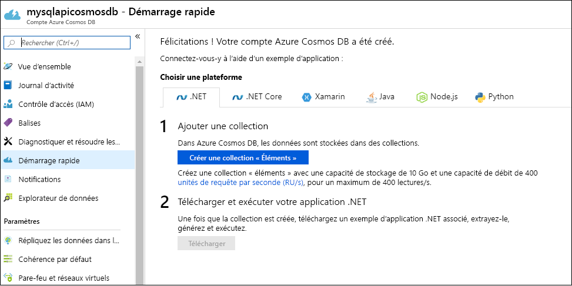

1. Connectez-vous au [Portail Azure](https://portal.azure.com/).
1. Sélectionnez **Créer une ressource** > **Bases de données** > **Azure Cosmos DB**.
   
   

1. Dans la page **Créer un compte Azure Cosmos DB**, entrez les paramètres de base du nouveau compte Azure Cosmos. 
 
    |Paramètre|Valeur|Description |
    |---|---|---|
    |Abonnement|Nom d’abonnement|Sélectionnez l’abonnement Azure à utiliser pour ce compte Azure Cosmos. |
    |Groupe de ressources|Nom de groupe ressources|Sélectionnez un groupe de ressources ou sélectionnez **Créer**, puis entrez un nom unique pour le nouveau groupe de ressources. |
    | Nom du compte|Entrez un nom unique|Entrez un nom pour identifier votre compte Azure Cosmos. Étant donné que *documents.azure.com* est ajouté à l’ID que vous fournissez pour créer votre URI, utilisez un ID unique.  L’ID peut uniquement contenir des lettres minuscules, des chiffres et le caractère de trait d’union (-). Sa longueur doit être comprise entre 3 et 31 caractères.|
    | API|Core (SQL)|L’API détermine le type de compte à créer. Azure Cosmos DB fournit cinq API : Core (SQL) et MongoDB pour les données de document, Gremlin pour les données de graphe, Table Azure et Cassandra. Actuellement, vous devez créer un compte distinct pour chaque API.   Sélectionnez **Core (SQL)** pour créer une base de données orientée document et effectuez des requêtes à l’aide de la syntaxe SQL.   [En savoir plus sur l’API SQL](../articles/cosmos-db/documentdb-introduction.md).|
    | Location|Sélectionner la région la plus proche de vos utilisateurs|Sélectionnez la zone géographique dans laquelle héberger votre compte Azure Cosmos DB. Utilisez l’emplacement le plus proche de vos utilisateurs pour leur donner l’accès le plus rapide possible aux données.|
   
   

1. Sélectionnez **Revoir + créer**. Vous pouvez ignorer les sections **Réseau** et **Balises**. 

1. Passez en revue les paramètres du compte, puis sélectionnez **Créer**. La création du compte prend quelques minutes. Attendez que la page du portail affiche **Votre déploiement est terminé**. 

    

1. Sélectionnez **Accéder à la ressource** pour accéder à la page du compte Azure Cosmos DB. 

    
