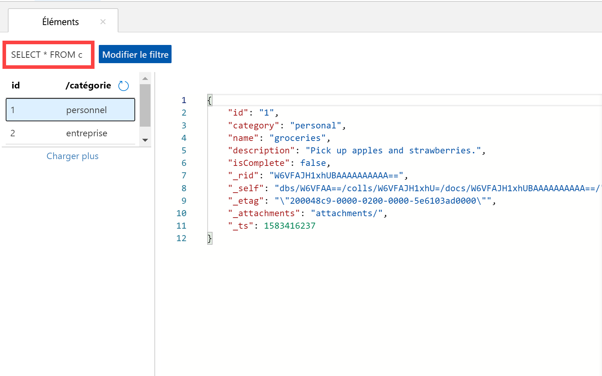

Vous pouvez désormais utiliser des requêtes dans l’Explorateur de données pour récupérer et filtrer vos données.

1. Notez que, par défaut, la requête est définie sur `SELECT * FROM c`. Cette requête par défaut récupère et affiche tous les documents de la collection. 

    

2. Restez sur l’onglet **Documents** et modifiez la requête en cliquant sur le bouton **Modifier le filtre**, en ajoutant `ORDER BY c._ts DESC` dans la zone de prédicat de requête, puis en cliquant sur **Appliquer un filtre**.

    

Cette requête modifiée répertorie les documents dans l’ordre décroissant en fonction de leur horodatage. Votre deuxième document apparaît désormais en tête de liste. Si vous êtes à l’aise avec la syntaxe SQL, vous pouvez saisir n’importe quelle [requête SQL](../articles/cosmos-db/sql-api-sql-query.md) compatible dans cette zone. 

L’exercice portant sur l’Explorateur de données est désormais terminé. Avant de démarrer l’exercice portant sur le code, notez que vous pouvez également utiliser l’Explorateur de données pour créer des procédures stockées, des fonctions définies par l’utilisateur et des déclencheurs afin d’exécuter la logique métier côté serveur ainsi que la mise à l’échelle du débit. L’Explorateur de données affiche tous les accès aux données par programmation intégrés disponibles dans l’API, mais permet d’accéder facilement à vos données dans le portail Azure.