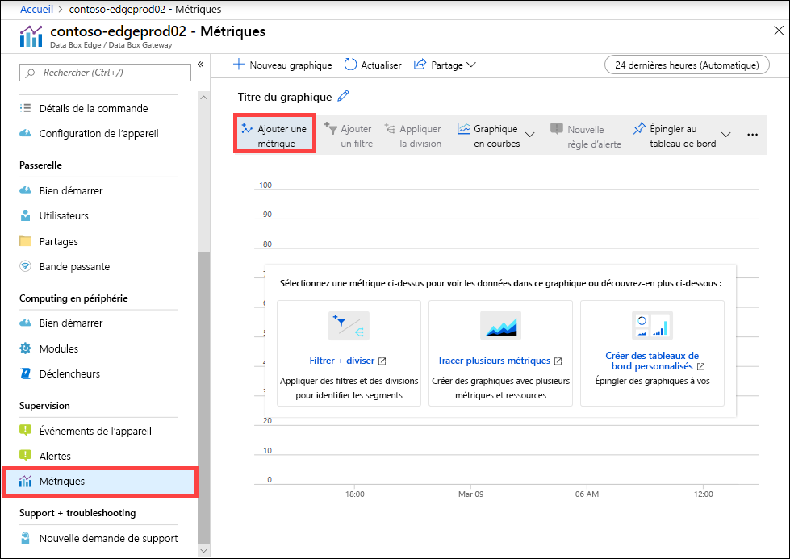
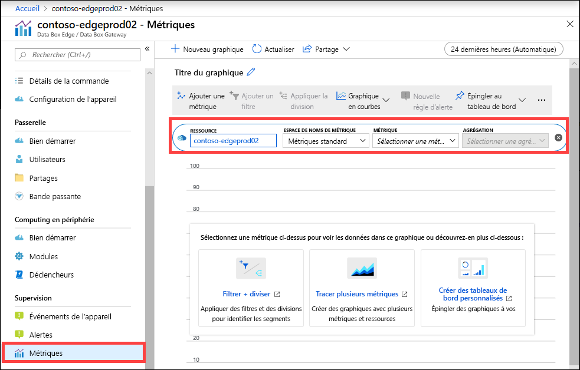
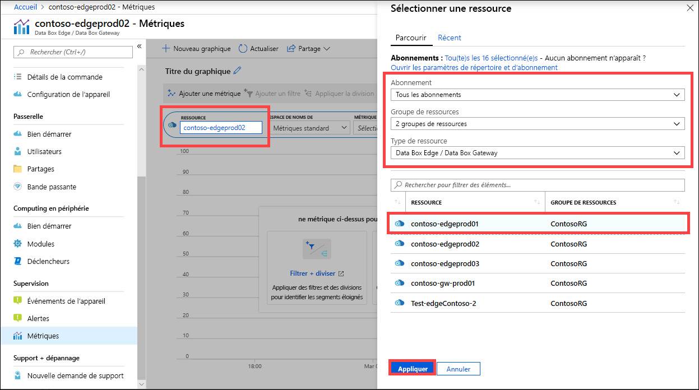
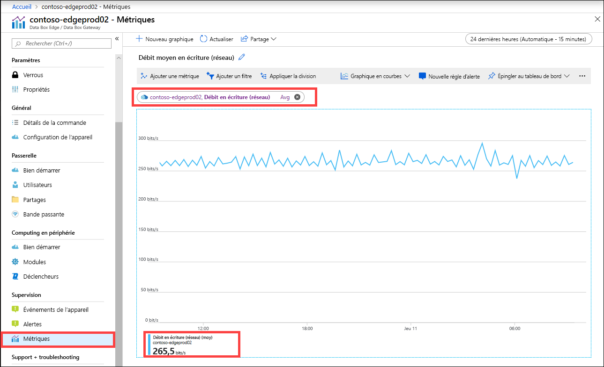
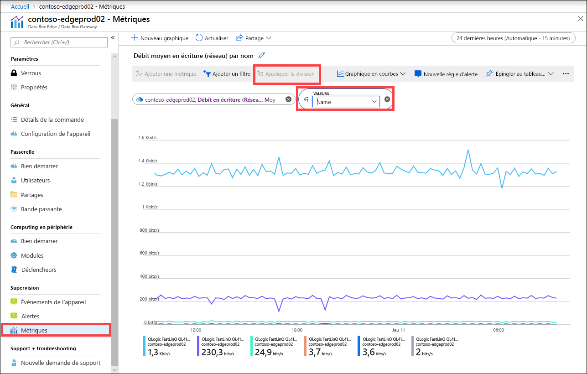
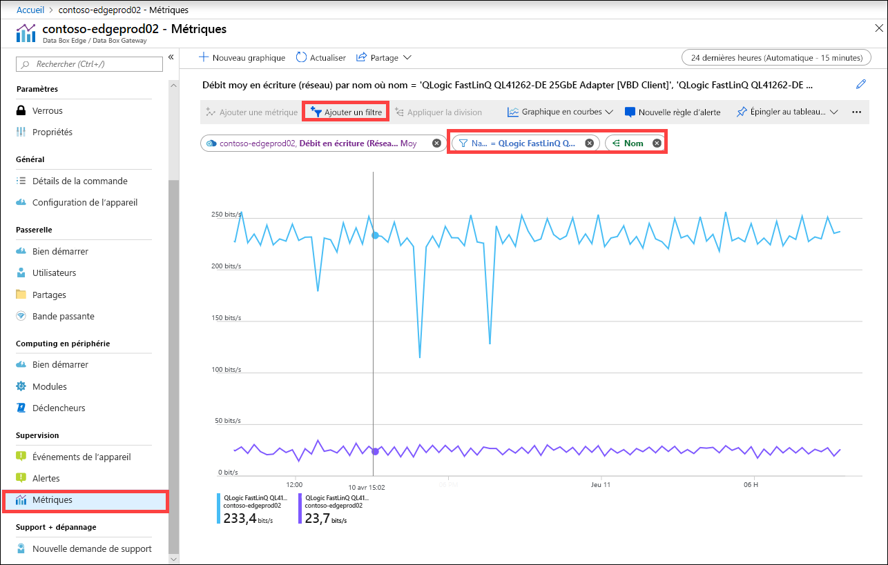

Vous pouvez également voir les métriques pour superviser les performances de l’appareil et, dans certains cas, pour résoudre les problèmes liés à l’appareil.

Effectuez les étapes suivantes dans le portail Azure pour créer un graphique des métriques d’appareil de votre choix.

1. Pour votre ressource dans le portail Azure, accédez à **Supervision > Métriques** et sélectionnez **Ajouter une métrique**.

    

2. La ressource est automatiquement renseignée.  

    

    Pour spécifier une autre ressource, sélectionnez-la. Dans le panneau **Sélectionner une ressource**, sélectionnez l’abonnement, le groupe de ressources, le type de ressource et la ressource pour laquelle vous souhaitez afficher les métriques et sélectionnez **Appliquer**.

    

3. Dans la liste déroulante, sélectionnez une métrique pour superviser votre appareil. Les métriques peuvent être des **métriques de capacité** ou des **métriques de transaction**. Les métriques de capacité sont liées à la capacité de l’appareil. Les métriques de transaction sont liées aux opérations de lecture et d’écriture dans Stockage Azure.

    |Métriques de capacité                     |Description  |
    |-------------------------------------|-------------|
    |**Capacité disponible**               | Fait référence à la taille des données qui peuvent être écrites sur l’appareil. En d’autres termes, il s’agit de la capacité qui peut être rendue disponible sur l’appareil.   Vous pouvez libérer la capacité de l’appareil en supprimant la copie locale des fichiers dont il existe une copie sur l’appareil ainsi que sur le cloud.        |
    |**Capacité totale**                   | Fait référence au nombre total d’octets sur l’appareil disponibles pour l’écriture de données. On parle également de taille totale du cache local.    Vous pouvez désormais augmenter la capacité d’un appareil virtuel existant en ajoutant un disque de données. Ajoutez un disque de données par le biais de la gestion de l’hyperviseur pour la machine virtuelle, puis redémarrez celle-ci. Le pool de stockage local de l’appareil de passerelle se développe de manière à accueillir le disque de données nouvellement ajouté.   Pour plus d’informations, consultez [Ajouter un disque dur pour la machine virtuelle Hyper-V](https://www.youtube.com/watch?v=EWdqUw9tTe4). |
    
    |Métriques de transaction              | Description         |
    |-------------------------------------|---------|
    |**Octets cloud chargés (appareil)**    | Somme de tous les octets chargés sur tous les partages de votre appareil        |
    |**Octets cloud chargés (partage)**     | Octets chargés par partage. Il peut s’agir des ordinateurs suivants :    Moyenne, à savoir (somme de tous les octets chargés par partage/nombre de partages)    Maximum, à savoir le nombre maximal d’octets chargés à partir d’un partage   Minimum, à savoir le nombre minimal d’octets chargés à partir d’un partage      |
    |**Débit de téléchargement cloud (partage)**| Octets téléchargés par partage. Il peut s’agir des ordinateurs suivants :    Moyenne, à savoir (somme de tous les octets lus ou téléchargés sur un partage/nombre de partages)    Maximum, à savoir le nombre maximal d’octets téléchargés à partir d’un partage   Minimum, à savoir le nombre minimal d’octets téléchargés à partir d’un partage  |
    |**Débit de lecture cloud**            | Somme de tous les octets lus à partir du cloud sur tous les partages de votre appareil     |
    |**Débit de chargement cloud**          | Somme de tous les octets écrits dans le cloud sur tous les partages de votre appareil     |
    |**Débit de chargement cloud (partage)**  | Somme de tous les octets écrits dans le cloud à partir d’un partage/nombre de partages, exprimée en valeur moyenne, maximale ou minimale par partage      |
    |**Débit de lecture (réseau)**           | Inclut le débit réseau système pour tous les octets lus à partir du cloud. Cette vue peut inclure des données qui ne sont pas limitées aux partages.   En divisant, vous affichez le trafic sur toutes les cartes réseau de l’appareil. Cela inclut les cartes qui ne sont pas connectées ou activées.      |
    |**Débit d’écriture (réseau)**       | Inclut le débit réseau système pour tous les octets écrits dans le cloud. Cette vue peut inclure des données qui ne sont pas limitées aux partages.   En divisant, vous affichez le trafic sur toutes les cartes réseau de l’appareil. Cela inclut les cartes qui ne sont pas connectées ou activées.          |
    |**Computing en périphérie - Utilisation de la mémoire**      | Cette métrique n’étant pas applicable à Data Box Gateway, elle n’est pas renseignée.          |
    |**Computing en périphérie - Pourcentage du processeur**    | Cette métrique n’étant pas applicable à Data Box Gateway, elle n’est pas renseignée.         |

4. Si une métrique est sélectionnée dans la liste déroulante, l’agrégation peut également être définie. L’agrégation fait référence à la valeur réelle agrégée sur un intervalle de temps spécifié. Les valeurs d’agrégation peuvent être les valeurs moyenne, minimale ou maximale. Sélectionnez Moyenne, Maximum ou Minimum comme agrégation.

    

5. Si la métrique que vous avez sélectionnée comporte plusieurs instances, l’option de division est disponible. Sélectionnez **Appliquer la division**, puis sélectionnez la valeur de référence à utiliser pour la répartition.

    

6. Si vous voulez à présent voir la répartition uniquement pour quelques instances, vous pouvez filtrer les données. Par exemple, dans ce cas, si vous souhaitez voir le débit réseau uniquement pour les deux interfaces réseau connectées sur votre appareil, vous pouvez filtrer ces interfaces. Sélectionnez **Ajouter un filtre** et spécifiez le nom de l’interface réseau pour le filtrage.

    

7. Vous pouvez également épingler le graphique au tableau de bord pour y accéder facilement.

    

8. Pour exporter les données du graphique dans une feuille de calcul Excel ou obtenir un lien vers le graphique en vue de le partager, sélectionnez l’option de partage dans la barre de commandes.

    