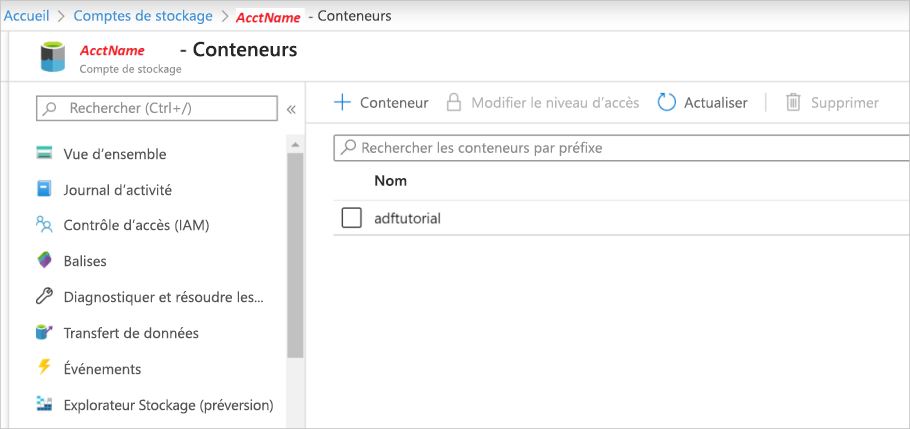

## <a name="prerequisites"></a>Prérequis

### <a name="azure-subscription"></a>Abonnement Azure
Si vous n’avez pas d’abonnement Azure, créez un [compte gratuit](https://azure.microsoft.com/free/) avant de commencer.

### <a name="azure-roles"></a>Rôles Azure
Pour créer des instances Data Factory, le compte d’utilisateur que vous utilisez pour vous connecter à Azure doit être membre des rôles *Contributeur* ou *Propriétaire*, ou *administrateur* de l’abonnement Azure. Pour voir les autorisations dont vous disposez dans l’abonnement, accédez au [portail Azure](https://portal.azure.com), sélectionnez votre nom d’utilisateur en haut à droite, sélectionnez l’icône «  **...**  » pour plus d’options, puis sélectionnez **Mes autorisations**. Si vous avez accès à plusieurs abonnements, sélectionnez l’abonnement approprié.

Les exigences applicables à la création et à la gestion des ressources enfants pour Data Factory (jeux de données, services liés, pipelines, déclencheurs et runtimes d’intégration) sont les suivantes :

- Pour créer et gérer des ressources enfants dans le Portail Azure, vous devez appartenir au rôle **Contributeurs de Data Factory** au niveau du groupe de ressources ou à un niveau supérieur.
- Pour créer et gérer des ressources enfants à l’aide de PowerShell ou du Kit de développement logiciel (SDK), le rôle **Contributeur** au niveau du groupe de ressources ou à un niveau supérieur est suffisant.

Pour découvrir des exemples d’instructions concernant l’ajout d’un utilisateur à un rôle, consultez l’article décrivant comment [ajouter des rôles](../articles/cost-management-billing/manage/add-change-subscription-administrator.md).

Pour plus d’informations, consultez les articles suivants :

- [Rôle Contributeurs de fabrique de données](../articles/role-based-access-control/built-in-roles.md#data-factory-contributor)
- [Roles and permissions for Azure Data Factory](../articles/data-factory/concepts-roles-permissions.md) (Rôles et autorisations pour Azure Data Factory)

### <a name="azure-storage-account"></a>Compte de Stockage Azure
Dans ce guide de démarrage rapide, vous utilisez un compte de Stockage Azure (plus précisément, un compte de Stockage Blob) à usage général à la fois comme magasins de données *source* et de *destination*. Si vous ne possédez pas de compte de Stockage Azure à usage général, consultez [Créer un compte de stockage](../articles/storage/common/storage-account-create.md) pour en créer un. 

#### <a name="get-the-storage-account-name"></a>Obtenir le nom du compte de stockage
Pour ce guide de démarrage rapide, vous aurez besoin du nom de votre compte de Stockage Azure. La procédure suivante détaille les étapes à suivre pour obtenir le nom de votre compte de stockage : 

1. Dans un navigateur web, accédez au [portail Azure](https://portal.azure.com) et connectez-vous à l’aide de vos nom d’utilisateur et mot de passe Azure.
2. Dans le menu Portail Azure, sélectionnez **Tous les services**, puis sélectionnez **Stockage** > **Comptes de stockage**. Vous pouvez également rechercher et sélectionner *Comptes de stockage* à partir de n’importe quelle page.
3. Dans la page **Comptes de stockage**, appliquez un filtre pour votre compte de stockage (si nécessaire), puis sélectionnez votre compte de stockage. 

Vous pouvez également rechercher et sélectionner *Comptes de stockage* à partir de n’importe quelle page.

#### <a name="create-a-blob-container"></a>Création d’un conteneur d’objets blob
Dans cette section, vous allez créer un conteneur d’objets blob nommé **adftutorial** dans un stockage Blob Azure.

1. Dans la page du compte de stockage, sélectionnez **Présentation** > **Conteneurs**.
2. Dans la barre d’outils de la page *\<Nom du compte>*  - **Conteneurs**, sélectionnez **Conteneur**.
3. Dans la boîte de dialogue **Nouveau conteneur**, saisissez le nom **adftutorial**, puis sélectionnez **OK**. La page *\<Nom du compte>*  - **Conteneurs** est mise à jour pour inclure **adftutorial** dans la liste des conteneurs.

   

#### <a name="add-an-input-folder-and-file-for-the-blob-container"></a>Ajouter un dossier et un fichier d’entrée pour le conteneur d’objets blob
Dans cette section, vous créez un dossier nommé **input** (entrée) dans le conteneur que vous venez de créer, puis chargez un exemple de fichier dans ce dossier. Avant de commencer, ouvrez un éditeur de texte tel que **Bloc-notes**, puis créez un fichier nommé **emp.txt** avec le contenu suivant :

```emp.txt
John, Doe
Jane, Doe
```

Enregistrez-le dans le dossier **C:\ADFv2QuickStartPSH** (si le dossier n’existe pas, créez-le). Revenez ensuite au portail Azure et procédez comme suit :

1. Dans la page *\<Nom du compte>*  - **Conteneurs**, là où vous vous êtes arrêté, sélectionnez **adftutorial** dans la liste mise à jour des conteneurs.

   1. Si vous avez fermé la fenêtre ou accédé à une autre page, connectez-vous au [Portail Azure](https://portal.azure.com) à nouveau.
   1. Dans le menu Portail Azure, sélectionnez **Tous les services**, puis sélectionnez **Stockage** > **Comptes de stockage**. Vous pouvez également rechercher et sélectionner *Comptes de stockage* à partir de n’importe quelle page.
   1. Sélectionnez votre compte de stockage, puis sélectionnez **Conteneurs** > **adftutorial**.

2. Dans la barre d’outils de la page du conteneur **adftutorial**, sélectionnez **Charger**.
3. Dans la page **Charger l’objet blob**, sélectionnez la zone **Fichiers**, puis recherchez et sélectionnez le fichier **emp.txt**.
4. Développez le titre **Avancé**. La page s’affiche à présent comme indiqué :

   
5. Dans la zone **Charger dans le dossier**, entrez **input**.
6. Cliquez sur le bouton **Charger**. Vous devriez voir le fichier **emp.txt** et l’état du chargement dans la liste.
7. Sélectionnez l’icône **Fermer** (**X**) pour fermer la page **Charger l’objet blob**.

Laissez la page du conteneur **adftutorial** ouverte. Vous l’utiliserez pour vérifier la sortie à la fin de ce guide de démarrage rapide.