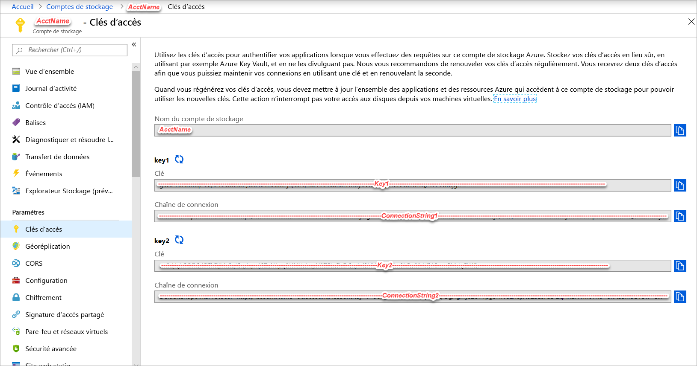

## <a name="prerequisites"></a>Composants requis

### <a name="azure-subscription"></a>Abonnement Azure
Si vous n’avez pas d’abonnement Azure, créez un compte [gratuit](https://azure.microsoft.com/free/) avant de commencer.

### <a name="azure-roles"></a>Rôles Azure
Pour créer des instances de fabrique de données, le compte d’utilisateur que vous utilisez pour vous connecter à Azure doit être un membre des rôles **contributeur** ou **propriétaire**, ou un **administrateur** de l’abonnement Azure. Dans le portail Azure, cliquez sur votre **nom d’utilisateur** dans le coin supérieur droit, puis sélectionnez **Autorisations** pour afficher les autorisations dont vous disposez dans l’abonnement. Si vous avez accès à plusieurs abonnements, sélectionnez l’abonnement approprié. Pour des exemples d’instructions concernant l’ajout d’un utilisateur à un rôle, consultez l’article [Ajout de rôles](../articles/billing/billing-add-change-azure-subscription-administrator.md).

### <a name="azure-storage-account"></a>Compte Stockage Azure
Dans ce guide de démarrage rapide, vous allez utiliser un compte Stockage Azure (un compte Stockage Blob, plus précisément) à usage général à la fois comme banque de données **source** et de **destination**. Si vous ne possédez pas de compte Stockage Azure à usage général, consultez [Créer un compte de stockage](../articles/storage/common/storage-create-storage-account.md#create-a-storage-account) pour en créer un. 

#### <a name="get-storage-account-name-and-account-key"></a>Obtenir le nom de compte de stockage et la clé de compte
Dans ce guide de démarrage rapide, vous spécifiez le nom et la clé de votre compte Stockage Azure. La procédure suivante détaille les étapes à suivre pour obtenir le nom et la clé de votre compte de stockage. 

1. Lancez un navigateur web et accédez au [portail Azure](https://portal.azure.com). Connectez-vous en utilisant un nom d’utilisateur et un mot de passe Azure. 
2. Cliquez sur **Plus de services >** dans le menu de gauche, filtrez en utilisant le mot clé **Stockage**, puis sélectionnez **Comptes de stockage**.

    
3. Dans la liste des comptes de stockage, appliquez un filtre pour votre compte de stockage (si nécessaire), puis sélectionnez **votre compte de stockage**. 
4. Dans la page **Compte de stockage**, sélectionnez **Clés d’accès** dans le menu.

    
5. Copiez les valeurs des champs **Nom du compte de stockage** et **key1** dans le presse-papiers. Collez-les dans un bloc-notes ou tout autre éditeur et enregistrez-le. Vous les utiliserez ultérieurement dans ce guide de démarrage rapide.   

#### <a name="create-input-folder-and-files"></a>Créer les dossiers et les fichiers d’entrée
Dans cette section, vous allez créer un conteneur d’objets blob nommé **adftutorial** dans votre stockage Blob Azure. Ensuite, vous créerez un dossier nommé **input** (entrée) dans le conteneur et chargerez un exemple de fichier dans ce dossier. 

1. Dans la page **Compte de stockage**, basculez vers la **vue d’ensemble**, puis cliquez sur **Objets blob**. 

    
2. Dans la page **Service BLOB**, cliquez sur **+ Conteneur** dans la barre d’outils. 

        
3. Dans la boîte de dialogue **Nouveau conteneur**, saisissez le nom **adftutorial**, puis cliquez sur **OK**. 

    
4. Cliquez sur **adftutorial** dans la liste des conteneurs. 

    
1. Dans la page **Conteneur**, cliquez sur **Charger** dans la barre d’outils.  

    
6. Dans la page **Charger l’objet blob**, cliquez sur **Avancé**.

    
7. Lancez le **Bloc-notes** et créez un fichier JSON nommé **emp.txt** avec le contenu ci-dessous. Enregistrez-le dans le dossier **c:\ADFv2QuickStartPSH** (créez le dossier **ADFv2QuickStartPSH** s’il n’existe pas déjà).
    
    ```
    John, Doe
    Jane, Doe
    ```    
8. Dans le portail Azure, dans la page **Charger l’objet blob**, recherchez et sélectionnez le fichier **emp.txt** pour le champ **Fichiers**. 
9. Entrez **input** dans le champ **Charger dans le dossier**. 

        
10. Vérifiez que le dossier est **input** et que le fichier est **emp.txt**, puis cliquez sur **Charger**.
11. Vous devriez voir le fichier **emp.txt** et l’état du chargement dans la liste. 
12. Fermez la page **Charger l’objet blob** en cliquant sur **X** en haut à droite. 

    
1. Laissez la page **Conteneur** ouverte. Vous l’utiliserez pour vérifier la sortie à la fin de ce guide de démarrage rapide.