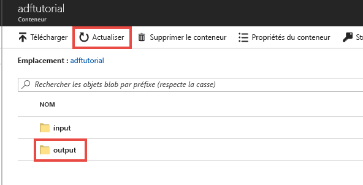
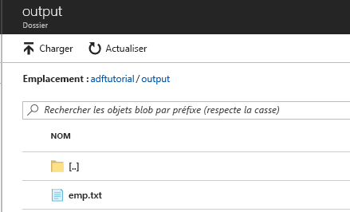

## <a name="verify-the-output"></a>Vérifier la sortie
Le pipeline crée automatiquement le dossier de sortie dans le conteneur d’objets blob adftutorial. Ensuite, il copie le fichier emp.txt à partir du dossier d’entrée dans le dossier de sortie. 

1. Dans le portail Azure, dans la page du conteneur **adftutorial**, cliquez sur **Actualiser** pour afficher le dossier de sortie (nommé output). 
    
    
2. Cliquez sur **output** dans la liste des dossiers. 
2. Vérifiez que le fichier **emp.txt** a été copié dans le dossier de sortie. 

    

## <a name="clean-up-resources"></a>Supprimer des ressources
Vous disposez de deux moyens de supprimer les ressources que vous avez créées dans le guide de démarrage rapide. Vous pouvez supprimer le [groupe de ressources Azure](../articles/azure-resource-manager/resource-group-overview.md) qui inclut toutes les ressources du groupe de ressources. Si vous souhaitez conserver les autres ressources, supprimez uniquement la fabrique de données créée dans ce tutoriel.

Si vous supprimez un groupe de ressources, toutes les ressources qu’il contient, y compris les fabriques de données, seront supprimées. Exécutez la commande suivante pour supprimer l’intégralité du groupe de ressources : 
```powershell
Remove-AzResourceGroup -ResourceGroupName $resourcegroupname
```

Remarque : la suppression d’un groupe de ressources peut prendre un certain temps. Veuillez patienter pendant ce processus.

Si vous souhaitez supprimer uniquement la fabrique de données, et non pas l’intégralité du groupe de ressources, exécutez la commande suivante : 

```powershell
Remove-AzDataFactoryV2 -Name $dataFactoryName -ResourceGroupName $resourceGroupName
```