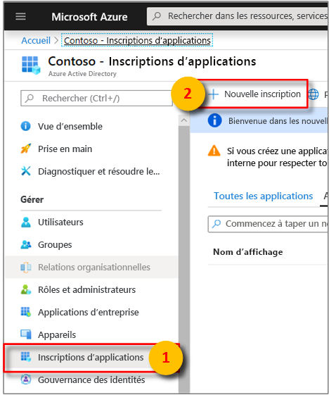
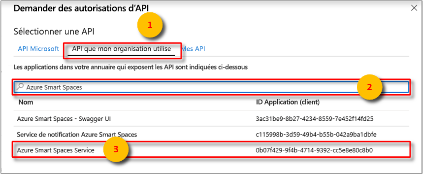

>[!NOTE]
>Cette section fournit les instructions sur [l’inscription de la nouvelle application Azure AD](https://docs.microsoft.com/azure/active-directory/develop/quickstart-register-app). Si vous disposez encore de la fonctionnalité d’inscription d’application native existante, vous pouvez l’utiliser tant qu’elle est prise en charge. De plus, si pour une raison quelconque, la nouvelle méthode d’inscription d’application ne fonctionne pas dans votre configuration, vous pouvez essayer de créer une application AAD native existante. Pour plus d’instructions, reportez-vous à [Inscrire votre application Azure Digital Twins avec l’ancien Azure Active Directory](../articles/digital-twins/how-to-use-legacy-aad.md). 

1. Dans le [Portail Azure](https://portal.azure.com), ouvrez **Azure Active Directory** dans le panneau de gauche, puis le volet **Inscriptions d’applications**. Sélectionnez le bouton **Nouvelle inscription**.

    

1. Dans la zone **Nom**, donnez un nom convivial à l’inscription de cette application. Sous la section **URI de redirection (facultatif)** , choisissez **Client public (mobile et bureau)** dans le menu déroulant à gauche, puis entrez `https://microsoft.com` dans la zone de texte à droite. Sélectionnez **Inscription**.

    

1. Pour vous assurer que [l’application est inscrite comme *app native*](https://docs.microsoft.com/azure/active-directory/develop/scenario-desktop-app-registration), ouvrez le volet **Authentification** de votre inscription d’application, et faites défiler vers le bas dans ce volet. Dans la section **Type de client par défaut**, choisissez **Oui** pour **Considérer l’application comme un client public**. 

    

1.  Ouvrez le volet **Vue d’ensemble** de votre application inscrite, et copiez les valeurs des entités suivantes dans un fichier temporaire. Ces valeurs vous permettront de configurer votre exemple d’application dans les sections suivantes.

    - **ID du client d’application**
    - **ID de l’annuaire (locataire)**

    

1. Ouvrez le volet **API autorisées** pour l’inscription de votre application. Sélectionnez le bouton **Ajouter une autorisation**. Dans le volet **Demander des autorisations d’API**, sélectionnez l’onglet **API utilisées par mon organisation**, puis recherchez :
    
    1. `Azure Digital Twins`. Sélectionnez l’API **Azure Digital Twins**.

        

    1. Vous pouvez également rechercher `Azure Smart Spaces Service`. Sélectionnez l’API **Azure Smart Spaces Service**.

        

    > [!IMPORTANT]
    > Le nom et l’ID de l’API Azure AD qui s’affichent dépendent de votre locataire :
    > * Les comptes de locataire et client utilisés pour les tests doivent rechercher `Azure Digital Twins`.
    > * Les autres comptes Microsoft doivent rechercher `Azure Smart Spaces Service`.

1. L’API sélectionnée apparaît sous la forme **Azure Digital Twins** dans le même volet **Demander des autorisations d’API**. Sélectionnez la liste déroulante **Read (1)** (Lire (1)), puis activez la case à cocher **Read.Write** (Lire.Écrire). Sélectionnez le bouton **Ajouter des autorisations**.

    

1. Selon les paramètres de votre organisation, vous devrez peut-être prendre des mesures supplémentaires pour autoriser l’accès de l’administrateur à cette API. Contactez votre administrateur pour obtenir plus d’informations. Une fois l’accès administrateur approuvé, la colonne **CONSENTEMENT ADMINISTRATEUR REQUIS** du volet **API autorisées** s’affichera comme suit pour vos API :

    

