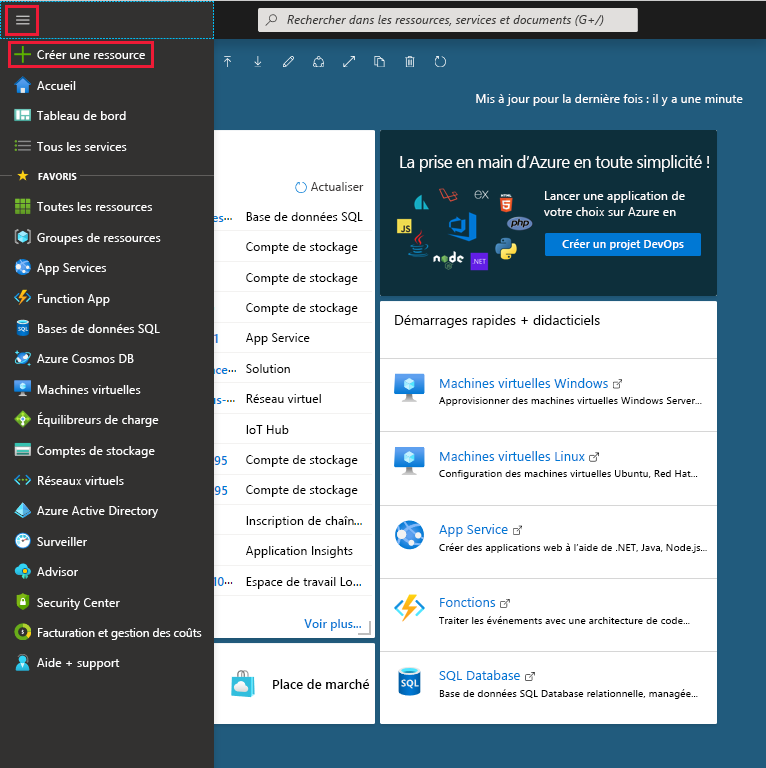
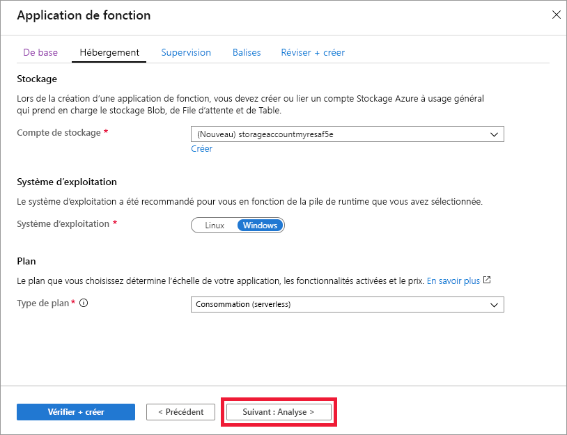

1. Dans le menu du portail Azure, sélectionnez **Créer une ressource**.

    

1. Dans la page **Nouveau**, sélectionnez **Calcul** > **Application de fonction**.

1. Utilisez les paramètres d’application de fonction comme indiqué dans le tableau sous l’image.

    

    | Paramètre      | Valeur suggérée  | Description |
    | ------------ | ---------------- | ----------- |
    | **Abonnement** | Votre abonnement | Abonnement sous lequel est créée cette nouvelle application de fonction. |
    | **[Groupe de ressources](../articles/azure-resource-manager/resource-group-overview.md)** |  *myResourceGroup* | Nom du nouveau groupe de ressources dans lequel créer votre Function App. |
    | **Nom de l’application de fonction** | Nom globalement unique | Nom qui identifie votre nouvelle Function App. Les caractères valides sont `a-z` (insensible à la casse), `0-9`et `-`.  |
    |**Publier**| Code | Option permettant de publier des fichiers de code ou un conteneur Docker. |
    | **Pile d’exécution** | Langage préféré | Choisissez un runtime qui prend en charge votre langage de programmation de fonction favori. Choisissez **.NET** pour les fonctions C# et F#. |
    |**Région**| Région recommandée | Choisissez une [région](https://azure.microsoft.com/regions/) près de chez vous ou près d’autres services auxquels ont accès vos fonctions. |

    Sélectionnez le bouton **Suivant : Hébergement >** .

1. Entrez les paramètres suivants pour l’hébergement.

    

    | Paramètre      | Valeur suggérée  | Description |
    | ------------ | ---------------- | ----------- |
    | **[Compte de stockage](../articles/storage/common/storage-quickstart-create-account.md)** |  Nom globalement unique |  Créez un compte de stockage utilisé par votre application de fonction. Les noms des comptes de stockage doivent comporter entre 3 et 24 caractères, uniquement des lettres minuscules et des chiffres. Vous pouvez également utiliser un compte existant qui doit répondre aux [exigences relatives aux comptes de stockage](../articles/azure-functions/functions-scale.md#storage-account-requirements). |
    |**Système d’exploitation**| Système d’exploitation préféré | Un système d’exploitation est présélectionné pour vous en fonction de la sélection de votre pile d’exécution, mais vous pouvez modifier le paramètre si nécessaire. |
    | **[Plan](../articles/azure-functions/functions-scale.md)** | Plan de consommation | Plan d’hébergement qui définit la façon dont les ressources sont allouées à votre Function App. Dans la valeur par défaut **Plan de consommation**, les ressources sont ajoutées dynamiquement comme requis par vos fonctions. Avec cet hébergement [serverless](https://azure.microsoft.com/overview/serverless-computing/), vous payez uniquement pour la durée d’exécution de vos fonctions. Si vous exécutez dans un plan App Service, vous devez gérer la [mise à l’échelle de votre application de fonction](../articles/azure-functions/functions-scale.md).  |

    Sélectionnez le bouton **Suivant : Surveillance >** .

1. Entrez les paramètres suivants pour la surveillance.

    

    | Paramètre      | Valeur suggérée  | Description |
    | ------------ | ---------------- | ----------- |
    | **[Application Insights](../articles/azure-functions/functions-monitoring.md)** | Default | Crée une ressource Application Insights avec le même *nom de l’application* dans la région prise en charge la plus proche. En développant ce paramètre, vous pouvez changer le **Nouveau nom de ressource** ou choisir un autre **Emplacement** dans une [Zone géographique Azure](https://azure.microsoft.com/global-infrastructure/geographies/) où vous voulez stocker vos données. |

    Sélectionnez **Vérifier + créer** pour passer en revue les sélections de configuration d’application.

1. Sélectionnez **Créer** pour configurer et déployer l’application de fonction.

1. Cliquez sur l’icône Notification en haut à droite du portail pour voir le message **Le déploiement a été effectué**.

    

1. Sélectionnez **Accéder à la ressource** pour afficher votre nouvelle application de fonction. Vous pouvez également sélectionner **Épingler au tableau de bord**. L’épinglage permet de revenir plus facilement à cette ressource d’application de fonction à partir de votre tableau de bord.
