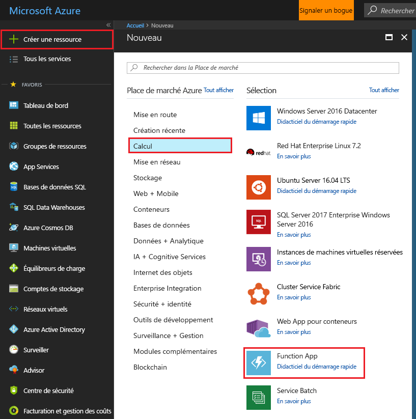

1. Cliquez sur le bouton **Nouveau** dans le coin supérieur gauche du portail Azure.

2. Cliquez sur **Calculer** > **Function App**, sélectionnez votre **Abonnement**, tapez dans le champ **Nom de l’application** un nom identifiant de manière unique votre Function App, puis spécifiez les paramètres suivants :
   
   * **[Groupe de ressources](../articles/azure-resource-manager/resource-group-overview.md)** : sélectionnez **Créer** et entrez un nom pour votre nouveau groupe de ressources. 
   * **[Plan d’hébergement](../articles/app-service/azure-web-sites-web-hosting-plans-in-depth-overview.md)**, que vous pouvez définir sur l’une des valeurs suivantes : 
     * **Plan de consommation** : type de plan par défaut pour Azure Functions. Lorsque vous choisissez un plan de consommation, vous devez également renseigner le champ **Emplacement**.  
     * **Plan App Service** : un plan App Service exige de créer un **Plan App Service/Emplacement** ou d’en sélectionner un existant. Ces paramètres déterminent [l’emplacement, les fonctionnalités, les coûts et les ressources de calcul](https://azure.microsoft.com/pricing/details/app-service/) associés à votre application.  
   * **Compte de stockage**: chaque Function App nécessite un compte de stockage. Vous pouvez choisir un compte de stockage existant ou [créer un compte de stockage](../articles/storage/storage-create-storage-account.md#create-a-storage-account). 
     
    

3. Cliquez sur **Créer** pour configurer et déployer la nouvelle Function App.  
