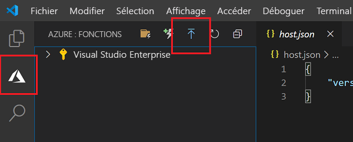

## Publication du projet sur Azure

Visual Studio Code vous permet de publier votre projet de fonctions directement sur Azure. Pendant le processus, vous créez une application de fonction et les ressources associées dans votre abonnement Azure. L’application de fonction fournit un contexte d'exécution pour vos fonctions. Le projet est empaqueté et déployé sur la nouvelle application de fonction dans votre abonnement Azure.

Cet article suppose que vous créez une nouvelle application de fonction. 

> [!IMPORTANT]
> La publication sur une application de fonction existante remplace le contenu de cette application dans Azure.

1. Dans la zone **Azure : Fonctions**, sélectionnez l'icône Déployer dans l'application de fonction.

    

1. Si ce n'est déjà fait, vous êtes invité à vous **connecter à Azure**. Vous pouvez également **créer un compte Azure gratuit**. Une fois la connexion établie à partir du navigateur, revenez à Visual Studio Code. 

1. Si vous disposez de plusieurs abonnements, **sélectionnez un abonnement** pour l'application de fonction, puis choisissez **+ Créer une nouvelle application de fonction dans Azure**.

1. Tapez un nom global unique qui identifie votre application de fonction et appuyez sur Entrée. Les caractères valides pour un nom d’application de fonction sont `a-z`, `0-9` et `-`.

1. Choisissez **+ Créer un groupe de ressources**, tapez un nom de groupe de ressources, par exemple `myResourceGroup`, et appuyez sur Entrée. Vous pouvez également utiliser un groupe de ressources existant.

1. Choisissez **+ Créer un compte de stockage**, tapez un nom global unique du nouveau compte de stockage utilisé par votre application de fonction et appuyez sur Entrée. Les noms des comptes de stockage doivent comporter entre 3 et 24 caractères, uniquement des lettres minuscules et des chiffres. Vous pouvez également utiliser un compte existant.

1. Choisissez également un emplacement dans une [région](https://azure.microsoft.com/regions/) proche de chez vous, ou proche d’autres services auxquels vos fonctions ont accès.

    Lorsque vous appuyez sur Entrée, les ressources Azure suivantes sont créées dans votre abonnement :

    * **[Groupe de ressources](../articles/azure-resource-manager/resource-group-overview.md)**  : contient toutes les ressources Azure créées. Le nom est basé sur le nom de votre application de fonction.
    * **[Compte de stockage](../articles/storage/common/storage-quickstart-create-account.md)**  : un compte de stockage standard est créé avec un nom unique, basé sur le nom de votre application de fonction.
    * **[Plan d'hébergement](../articles/azure-functions/functions-scale.md)**  : un plan de consommation est créé dans la région USA Ouest pour héberger votre application de fonction serverless.
    * **Application de fonction** : votre projet est déployé dans cette nouvelle application de fonction avant d'y être exécuté.

    Une notification s’affiche après que votre application de fonction a été créée et que le package de déploiement a été appliqué. Sélectionnez **Afficher la sortie de** dans cette notification pour afficher les résultats de la création et du déploiement, y compris les ressources Azure que vous avez créées.

1. Dans la zone **Azure : Fonctions**, développez la nouvelle application de fonction sous votre abonnement. Développez **Fonctions**, cliquez avec le bouton droit sur **HttpTrigger**, puis choisissez **Copier l'URL de fonction**.

    
