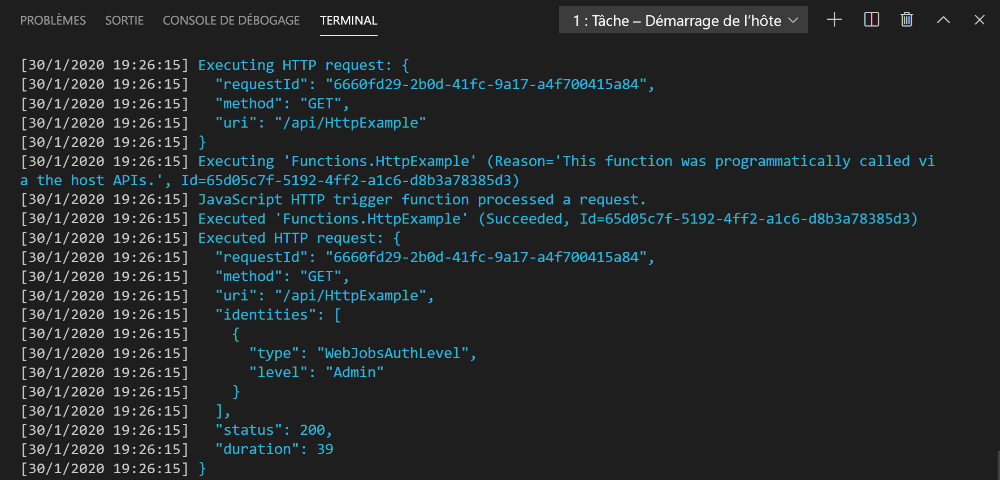

## Exécuter la fonction localement

Visual Studio Code s’intègre à [Azure Functions Core Tools](../articles/azure-functions/functions-run-local.md) pour vous permettre d’exécuter ce projet sur votre ordinateur de développement local avant toute publication sur Azure.

1. Pour appeler votre fonction, appuyez sur F5 pour démarrer le projet d’application de fonction. La sortie de Core Tools est affichée dans le panneau **Terminal**.

1. Si vous n’avez pas encore installé Azure Functions Core Tools, sélectionnez **Installer** à l’invite. Quand Core Tools est installé, votre application démarre dans le panneau **Terminal**. Vous pouvez voir le point de terminaison de l’URL de votre fonction déclenchée par HTTP en cours d’exécution localement. 

    

1. Avec Core Tools en cours d’exécution, accédez à l’URL suivante pour exécuter une requête GET, qui inclut la chaîne de requête `?name=Functions`.

    <http://localhost:7071/api/HttpExample?name=Functions>

1. Une réponse est retournée, semblable à celle-ci dans un navigateur :

    

1. Les informations relatives à la requête s’affichent dans le panneau **Terminal**.

    

1. Appuyez sur Ctrl+C pour arrêter Core Tools et déconnecter le débogueur.
