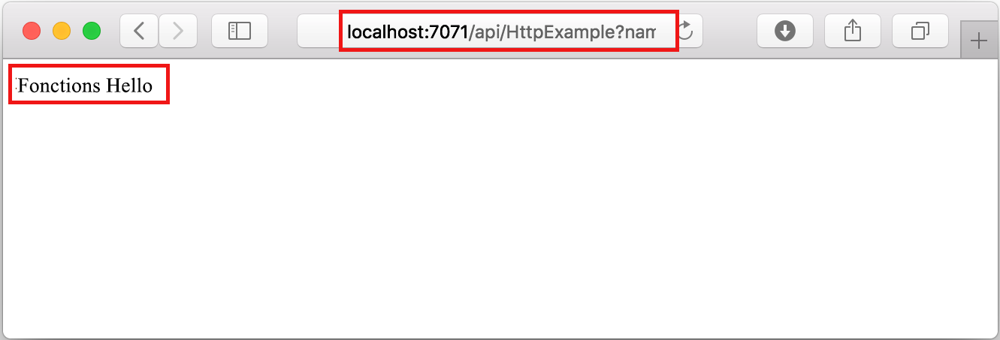

## Exécuter la fonction localement

Visual Studio Code s’intègre à [Azure Functions Core Tools](../articles/azure-functions/functions-run-local.md) pour vous permettre d’exécuter ce projet sur votre ordinateur de développement local avant toute publication sur Azure.

1. Pour appeler votre fonction, appuyez sur F5 pour démarrer le projet d’application de fonction. La sortie de Core Tools est affichée dans le panneau **Terminal**.

1. Si vous n’avez pas encore installé Azure Functions Core Tools, sélectionnez **Installer** à l’invite. Quand Core Tools est installé, votre application démarre dans le panneau **Terminal**.

1. Dans le panneau **Terminal**, copiez le point de terminaison de l’URL de votre fonction déclenchée via HTTP. 

    

1. Collez l’URL de la demande HTTP dans la barre d’adresses de votre navigateur. Ajoutez la chaîne de requête `?name=<yourname>` à cette URL et exécutez la demande GET. 

1. Une réponse est retournée, semblable à celle-ci dans un navigateur :

    

1. Appuyez sur Maj+F5 pour arrêter Core Tools et déconnecter le débogueur.
