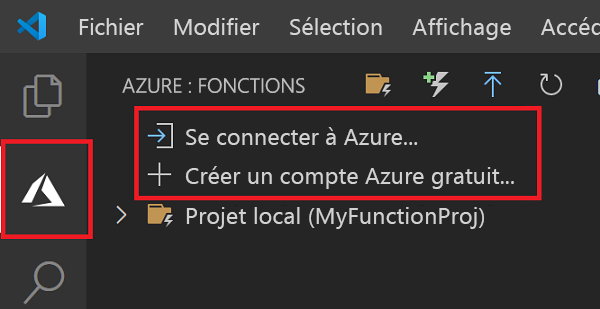

## Connexion à Azure

Avant de pouvoir publier votre application, vous devez vous connecter à Azure. Si vous êtes déjà connecté, passez à la section suivante.

1. Choisissez l’icône Azure dans la barre d’activité, puis dans la zone **Azure : Fonctions**, choisissez **Se connecter à Azure...** . Si vous ne l’avez pas encore fait, vous pouvez **Créer un compte Azure gratuit**.

    

1. Quand vous y êtes invité dans le navigateur, choisissez votre compte Azure, puis connectez-vous à l’aide de vos informations d’identification de compte Azure. 

1. Une fois la connexion réussie, vous pouvez fermer la nouvelle fenêtre de navigateur. Les abonnements qui font partie de votre compte Azure sont affichés dans la barre latérale.
