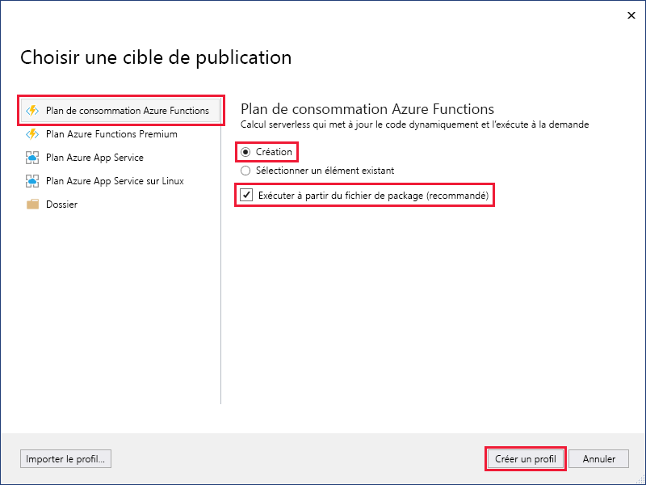

1. Dans **l’Explorateur de solutions**, cliquez avec le bouton droit sur le projet, puis sélectionnez **Publier**.

2. Dans la boîte de dialogue **Choisir une cible de publication**, utilisez les options de publication comme indiqué dans le tableau sous l’image : 

    

    | Option      | Description                                |
    | ------------ |  -------------------------------------------------- |
    | **Plan Consommation Azure Functions** |   Quand vous publiez votre projet dans une application de fonction qui s'exécute dans un [Plan Consommation](../articles/azure-functions/functions-scale.md#consumption-plan), vous payez uniquement pour les exécutions de votre application. D’autres plans d’hébergement occasionnent des coûts plus élevés. Pour en savoir plus, voir [Mise à l’échelle et hébergement d’Azure Functions](../articles/azure-functions/functions-scale.md). | 
    | **Créer** | Une nouvelle application de fonction, avec les ressources associées, est créée dans Azure. Lorsque vous choisissez **Sélectionner existant**, tous les fichiers de l’application de fonction existante dans Azure sont remplacés par les fichiers du projet local. N’utilisez cette option que lorsque vous réappliquez des mises à jour à une application de fonction existante. |
    | **Exécuter à partir d’un fichier de package** | Votre application de fonction est déployée en utilisant [Zip Deploy](../articles/azure-functions/functions-deployment-technologies.md#zip-deploy) avec le mode [Exécuter à partir du fichier de package](../articles/azure-functions/run-functions-from-deployment-package.md) activé. Il s’agit de la méthode recommandée pour exécuter vos fonctions, car elle produit de meilleures performances. Quand vous n’utilisez pas cette option, veillez à ce que votre projet d’application de fonction ne s’exécute pas localement avant de publier sur Azure. |

3. Sélectionnez **Publier**. Si vous ne vous êtes pas encore connecté à votre compte Azure à partir de Visual Studio, sélectionnez **Connexion**. Vous pouvez également créer un compte Azure gratuit.

4. Dans la boîte de dialogue **Azure App Service : Créer nouveau**, utilisez les paramètres **Hébergement** comme indiqué dans le tableau situé sous l’image :

    

    | Paramètre      | Valeur suggérée  | Description                                |
    | ------------ |  ------- | -------------------------------------------------- |
    | **Nom** | Nom globalement unique | Nom qui identifie uniquement votre nouvelle application de fonction. Les caractères valides sont `a-z`, `0-9` et `-`. |
    | **Abonnement** | Choisir votre abonnement | Sélectionnez l’abonnement Azure à utiliser. |
    | **[Groupe de ressources](../articles/azure-resource-manager/management/overview.md)** | myResourceGroup |  Nom du groupe de ressources où créer votre application de fonction. Choisissez **Nouveau** pour créer un groupe de ressources.|
    | **[Plan d’hébergement](../articles/azure-functions/functions-scale.md)** | Plan de consommation | Après avoir sélectionné **Nouveau** pour créer un plan serverless, veillez à choisir **Consommation** sous **Taille**. Choisissez également un **Emplacement** dans une [région](https://azure.microsoft.com/regions/) près de chez vous ou près d’autres services auxquels ont accès vos fonctions. Si vous exécutez un plan autre que le plan **Consommation**, vous devez gérer la [mise à l’échelle de votre application de fonction](../articles/azure-functions/functions-scale.md).  |
    | **[Stockage Azure](../articles/storage/common/storage-account-create.md)** | Compte de stockage à usage général | Un compte de stockage Azure est obligatoire par le runtime Functions. Sélectionnez **Nouveau** pour créer un compte de stockage universel. Vous pouvez également utiliser un compte existant qui répond aux [exigences relatives aux comptes de stockage](../articles/azure-functions/functions-scale.md#storage-account-requirements).  |

5. Sélectionnez **Créer** pour créer une application de fonction et les ressources associées dans Azure avec ces paramètres et déployer votre code de projet de fonction. 

6. Une fois le déploiement terminé, notez la valeur **URL du site**, qui est l’adresse de votre application de fonctions dans Azure.

    
