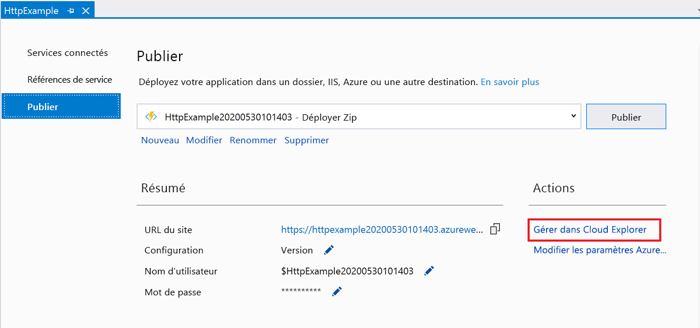

1. Dans **l’Explorateur de solutions**, cliquez avec le bouton droit sur le projet, puis sélectionnez **Publier**.

2. Sélectionnez **Application Azure Function**, choisissez **Créer**, puis sélectionnez **Publier**.

     

    Quand vous cliquez sur **Exécuter à partir du fichier de package (recommandé)** , votre application de fonction est déployée à l’aide de [Zip Deploy](../articles/azure-functions/functions-deployment-technologies.md#zip-deploy) avec le mode d’[exécution à partir du package](../articles/azure-functions/run-functions-from-deployment-package.md) activé. Il s’agit de la méthode recommandée pour exécuter vos fonctions car elle produit de meilleures performances.

    >[!CAUTION]
    >Lorsque vous choisissez **Sélectionner existant**, tous les fichiers de l’application de fonction existante dans Azure sont remplacés par les fichiers du projet local. N’utilisez cette option que lorsque vous réappliquez des mises à jour à une application de fonction existante.

3. Si vous n’avez pas déjà connecté Visual Studio à votre compte Azure, sélectionnez **Ajouter un compte...** .

4. Dans la boîte de dialogue **Créer App Service**, utilisez les paramètres d’**hébergement** comme spécifiés dans le tableau sous l’image :

    

    | Paramètre      | Valeur suggérée  | Description                                |
    | ------------ |  ------- | -------------------------------------------------- |
    | **Nom de l’application** | Nom globalement unique | Nom qui identifie uniquement votre nouvelle application de fonction. |
    | **Abonnement** | Choisissez votre abonnement | Sélectionnez l’abonnement Azure à utiliser. |
    | **[Groupe de ressources](../articles/azure-resource-manager/resource-group-overview.md)** | myResourceGroup |  Nom du groupe de ressources où créer votre application de fonction. Choisissez **Nouveau** pour créer un groupe de ressources.|
    | **[Plan App Service](../articles/azure-functions/functions-scale.md)** | Plan de consommation | Veillez à choisir **Consommation** sous **Taille** après avoir cliqué sur **Nouveau** pour créer un plan serverless. Choisissez également un **Emplacement** dans une [région](https://azure.microsoft.com/regions/) près de chez vous ou près d’autres services auxquels ont accès vos fonctions. Si vous exécutez un plan autre que le plan **Consommation**, vous devez gérer la [mise à l’échelle de votre application de fonction](../articles/azure-functions/functions-scale.md).  |
    | **[Compte de stockage](../articles/storage/common/storage-quickstart-create-account.md)** | Compte de stockage à usage général | Un compte de stockage Azure est obligatoire par le runtime Functions. Cliquez sur **Nouveau** pour créer un compte de stockage universel. Vous pouvez également utiliser un compte existant qui répond aux [exigences relatives aux comptes de stockage](../articles/azure-functions/functions-scale.md#storage-account-requirements).  |

5. Cliquez sur **Créer** pour créer une application de fonctions et les ressources associées dans Azure avec ces paramètres et déployer votre code de projet de fonction. 

6. Une fois le déploiement terminé, notez la valeur **URL du site**, qui est l’adresse de votre application de fonctions dans Azure.

    
