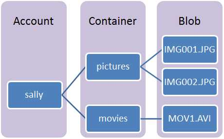

## Présentation du stockage d'objets blob

Le stockage d'objets blob Azure est un service permettant de stocker de grandes quantités de données accessibles depuis n'importe où dans le monde via HTTP ou HTTPS. Un seul objet blob peut avoir une taille de plusieurs centaines de gigaoctets et un seul compte de stockage peut contenir jusqu'à 200 To d'objets blob s'il a été créé le 8 juin 2012 ou après ; les comptes de stockage créés avant cette date peuvent contenir jusqu'à 100 To d'objets blob. Pour plus d'informations sur la capacité du compte de stockage, consultez la page [Objectifs de performance et
évolutivité du stockage Azure][1].

Voici quelques utilisations courantes du stockage d'objets blob :

* Mise à disposition d'images ou de documents directement dans un
  navigateur
* Stockage de fichiers pour un accès distribué
* Diffusion en continu de vidéo et d'audio
* Sauvegarde sécurisée et récupération d'urgence
* Stockage des données pour l'analyse par un service local ou hébergé
  par Azure

Vous pouvez utiliser le stockage d'objets blob pour exposer les données publiquement dans le monde ou en privé pour le stockage d'applications internes.

## Concepts

Le service d'objets blob contient les composants suivants :

* **Compte de stockage :** tous les accès au stockage Azure sont
  effectués via un compte de stockage. Pour plus d'informations sur la
  capacité du compte de stockage, consultez la page [Objectifs de
  performance et évolutivité du stockage Azure][1].

* **Conteneur :** un conteneur regroupe un ensemble d'objets blob. Tous
  les objets blob doivent figurer dans un conteneur. Un compte peut
  contenir un nombre illimité de conteneurs. Un conteneur peut stocker
  un nombre illimité d'objets blob.

* **Blob :** fichier de n'importe quel type et de n'importe quelle
  taille. Il existe deux types d'objets blob qui peuvent être
  enregistrés dans un stockage Azure : les objets blob de blocs et les
  objets blob de pages. La plupart des fichiers sont des objets blob de
  blocs. Un seul objet blob de blocs peut avoir une taille maximale de
  200 Go. Ce didacticiel utilise des objets blob de blocs. Les objets
  blob de pages, autre type d'objets blob, peuvent avoir une taille de
  1 To et sont plus efficaces lorsque des plages d'octets dans un
  fichier sont modifiées fréquemment. Pour plus d'informations sur les
  blobs, consultez la page [Présentation des objets BLOB de blocs et des
  objets BLOB de pages][2].

* **Format d'URL :** Les objets blob sont adressables à l'aide du
  format d'URL suivant :   
   http://`<storage 
  account>`.blob.core.windows.net/`<container>`/`<blob>`
  
  L'URL de l'exemple suivant peut être utilisée pour traiter l'un des
  objets blob dans le diagramme ci-dessus :  
   `http://sally.blob.core.windows.net/movies/MOV1.AVI`

[1]: http://msdn.microsoft.com/fr-fr/library/dn249410.aspx
[2]: http://msdn.microsoft.com/fr-fr/library/windowsazure/ee691964.aspx