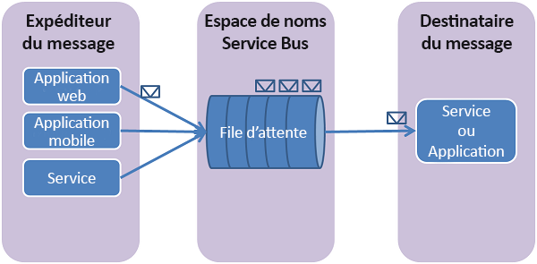

## Présentation des files d'attente Service Bus
Les files d’attente Service Bus prennent en charge un modèle de communication de **messagerie répartie** . Lors de l’utilisation de files d’attente, les composants d’une application distribuée ne communiquent pas directement entre eux ; ils échangent plutôt des messages via une file d’attente, qui fait office d’intermédiaire (broker). Un producteur de messages (expéditeur) remet un message à la file d’attente, puis continue son traitement. De manière asynchrone, un consommateur de message (destinataire) extrait le message de la file d’attente, puis le traite. L’expéditeur ne doit pas forcément attendre une réponse du destinataire afin de continuer à traiter et à envoyer d’autres messages. Les files d’attente permettent la livraison de messages sur le principe du **premier entré, premier sorti (FIFO)** à un ou plusieurs destinataires concurrents. Autrement dit, les messages sont en général reçus et traités par les destinataires dans l’ordre dans lequel ils ont été ajoutés à la file d’attente ; chaque message est reçu et traité par un seul consommateur de message uniquement.

Les files d’attente Service Bus sont une technologie à usage généraliste pouvant servir à une grande diversité de situations :

* Communication entre les rôles Web et les rôles de travail dans une application multiniveau Azure.
* Communication entre les applications locales et les applications hébergées par Azure dans une solution hybride.
* Communication entre les composants d’une application distribuée s’exécutant en local dans différentes organisations ou dans différents services d’une organisation.

L’utilisation de files d’attente vous permet de mettre à l’échelle vos applications plus facilement, et permet une résilience supérieure dans votre architecture.

