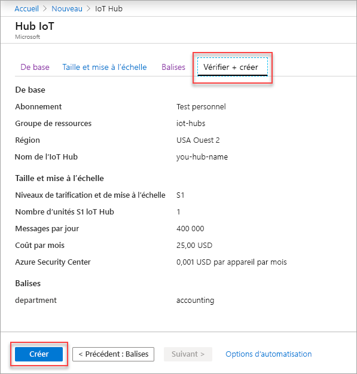

Cette section décrit comment créer un hub IoT à l’aide du [portail Azure](https://portal.azure.com).

1. Connectez-vous au [portail Azure](https://portal.azure.com). 

2. Choisissez +**Créer une ressource**, puis choisissez **Internet des objets**.

3. Cliquez sur **IoT Hub** dans la liste à droite. Vous voyez le premier écran de création d’un hub IoT.

   

   Renseignez les champs.

   **Abonnement**: Sélectionnez l’abonnement à utiliser pour votre hub IoT.

   **Groupe de ressources** : Vous pouvez créer un groupe de ressources ou utiliser un groupe existant. Pour créer un nouveau groupe, cliquez sur **Créer** et indiquez le nom que vous voulez utiliser. Pour utiliser un groupe de ressources existant, cliquez sur **Utiliser existant** et sélectionnez le groupe de ressources dans la liste déroulante. Pour plus d’informations, consultez [Gérer des groupes de ressources Azure Resource Manager](../articles/azure-resource-manager/manage-resource-groups-portal.md).

   **Région** : Il s’agit de la région dans laquelle vous voulez placer votre hub. Sélectionnez l’endroit le plus proche dans la liste déroulante.

   **Nom du hub IoT** : Indiquez le nom de votre hub IoT. Ce nom doit être globalement unique. Si le nom saisi est disponible, une coche verte s’affiche.

   [!INCLUDE [iot-hub-pii-note-naming-hub](iot-hub-pii-note-naming-hub.md)]

4. Cliquez sur **Suivant : taille et échelle** pour poursuivre la création de votre hub IoT.

   

   Dans cet écran, vous pouvez conserver les valeurs par défaut et cliquer simplement en bas sur **Vérifier + créer**. 

   **Tarification et niveau de mise à l’échelle** : Vous pouvez choisir à partir de plusieurs niveaux, selon le nombre de fonctionnalités souhaité et le nombre de messages envoyés via votre solution par jour. Le niveau gratuit est destiné aux tests et à l’évaluation. Il permet la connexion de 500 appareils à IoT Hub, avec jusqu’à 8 000 messages par jour. Chaque abonnement Azure peut créer un IoT Hub dans le niveau gratuit. 

   **Unités IoT Hub** : Le nombre de messages autorisés par unité par jour dépend du niveau de tarification de votre concentrateur. Par exemple, si vous souhaitez qu’IoT Hub prenne en charge l’arrivée de 700 000 messages, vous choisissez deux unités de niveau S1.

   Pour plus d’informations sur les autres options de niveau, consultez [Choix du bon niveau IoT Hub](../articles/iot-hub/iot-hub-scaling.md).

   **Paramètres avancés / Partitions appareil-à-cloud** : cette propriété associe les messages appareil-à-cloud au nombre de lecteurs simultanés des messages. La plupart des hubs IoT ont besoin de seulement 4 partitions. 

5. Cliquez sur **Vérifier + créer** pour passer en revue vos choix. Vous voyez quelque chose de similaire à cet écran.

   

6. Cliquez sur **Créer** pour créer votre hub IoT. La création du hub prend quelques minutes.
