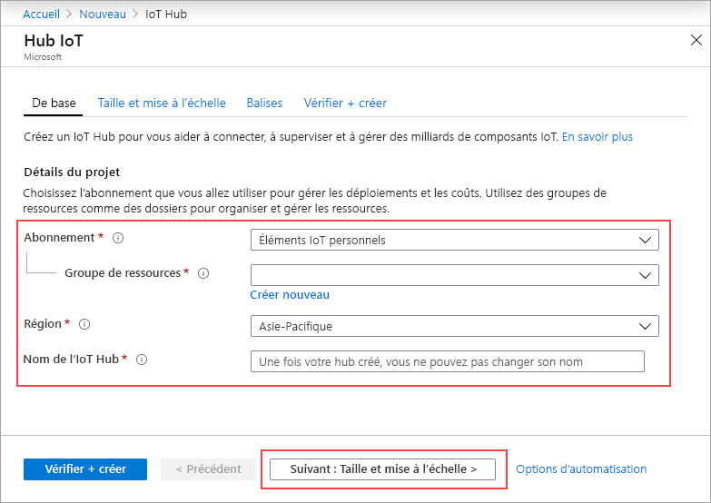
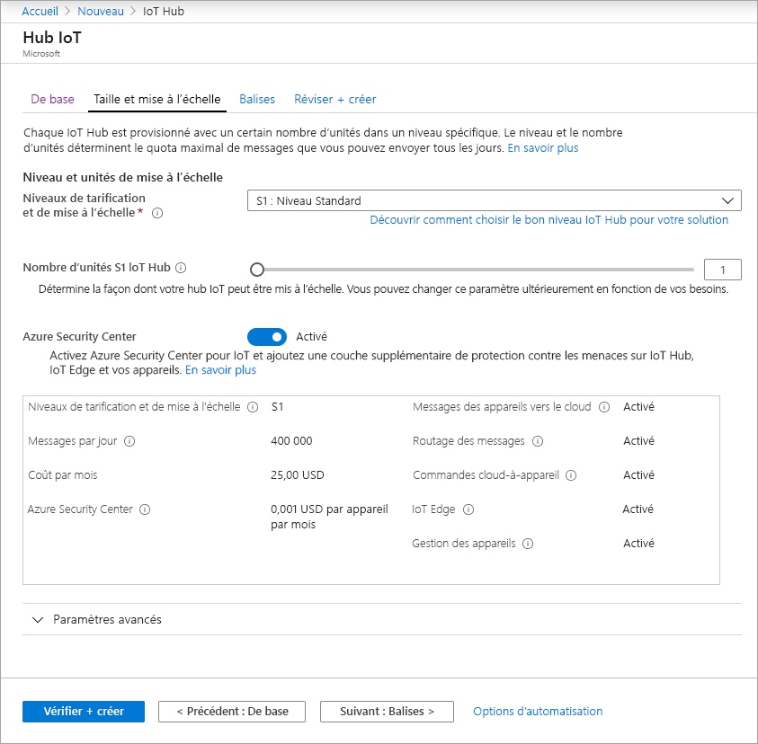
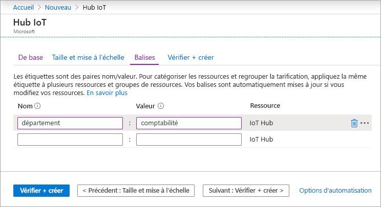

Cette section décrit comment créer un hub IoT à l’aide du [portail Azure](https://portal.azure.com).

1. Connectez-vous au [portail Azure](https://portal.azure.com).

1. Dans la page d’accueil Azure, sélectionnez le bouton **+ Créer une ressource**, puis entrez *IoT Hub* dans le champ **Rechercher dans la Place de marché**.

1. Sélectionnez **IoT Hub** dans les résultats de la recherche, puis **Créer**.

1. Dans l'onglet **De base**, renseignez les champs comme suit :

   - **Abonnement**: Sélectionnez l’abonnement à utiliser pour votre hub.

   - **Groupe de ressources** : Sélectionnez un groupe de ressources ou créez-en un. Pour créer un nouveau groupe, sélectionnez **Créer** et indiquez le nom que vous voulez utiliser. Pour utiliser un groupe de ressources existant, sélectionnez-le. Pour plus d’informations, consultez [Gérer des groupes de ressources Azure Resource Manager](../articles/azure-resource-manager/management/manage-resource-groups-portal.md).

   - **Région** : Sélectionnez la région dans laquelle vous voulez placer votre hub. Sélectionnez l’emplacement le plus proche de vous. Certaines fonctionnalités, telles que les [flux d’appareils IoT Hub](../articles/iot-hub/iot-hub-device-streams-overview.md), sont disponibles uniquement dans certaines régions. Pour ces fonctionnalités limitées, vous devez sélectionner l’une des régions prises en charge.

   - **Nom du hub IoT** : Entrez un nom pour votre hub. Ce nom doit être globalement unique. Si le nom saisi est disponible, une coche verte s’affiche.

   [!INCLUDE [iot-hub-pii-note-naming-hub](iot-hub-pii-note-naming-hub.md)]

   

1. Sélectionnez **Suivant : taille et échelle** pour poursuivre la création de votre hub.

   

   Vous pouvez accepter les paramètres par défaut ici. Si vous le souhaitez, vous pouvez modifier les champs suivants : 

    - **Tarification et niveau de mise à l’échelle** : Le niveau sélectionné. Vous pouvez choisir parmi plusieurs niveaux, selon le nombre de fonctionnalités souhaité et le nombre de messages envoyés par jour par l’intermédiaire de votre solution. Le niveau gratuit est destiné aux tests et à l’évaluation. Il permet la connexion de 500 appareils au hub, avec jusqu’à 8 000 messages par jour. Chaque abonnement Azure peut créer un hub IoT dans le niveau gratuit. 

      Si vous suivez un guide de démarrage rapide pour les flux d’appareils IoT Hub, sélectionnez le niveau gratuit.

    - **Unités IoT Hub** : Le nombre de messages autorisés par unité par jour dépend du niveau de tarification de votre concentrateur. Par exemple, si vous souhaitez que le hub prenne en charge l’arrivée de 700 000 messages, vous choisissez deux unités de niveau S1.
    Pour plus d’informations sur les autres options de niveau, consultez [Choix du bon niveau IoT Hub](../articles/iot-hub/iot-hub-scaling.md).

    - **Azure Security Center** : Activez cette fonction pour ajouter une couche de protection supplémentaire contre les menaces à IoT et à vos appareils. Cette option n’est pas disponible pour les hubs au niveau gratuit. Pour plus d’informations sur cette fonctionnalité, consultez [Azure Security Center pour IoT](https://docs.microsoft.com/azure/asc-for-iot/).

    - **Paramètres avancés** > **Partitions appareil-à-cloud** : cette propriété associe les messages appareil-à-cloud au nombre de lecteurs simultanés des messages. La plupart des hubs n’ont besoin que de 4 partitions.

1.  Sélectionnez **Suivant : Étiquettes** pour continuer à l’écran suivant.

    Les étiquettes sont des paires nom/valeur. Vous pouvez affecter la même étiquette à plusieurs ressources et groupes de ressources pour catégoriser les ressources et regrouper la facturation. Pour plus d’informations, consultez [Utiliser des étiquettes pour organiser vos ressources Azure](../articles/azure-resource-manager/management/tag-resources.md).

    

1.  Sélectionnez **Suivant : Vérifier + créer** pour passer en revue vos choix. Un écran semblable au suivant s’affiche, mais avec les valeurs que vous avez sélectionnées lors de la création du hub. 

    

1.  Sélectionnez **Créer** pour créer votre hub. La création du hub prend quelques minutes.
