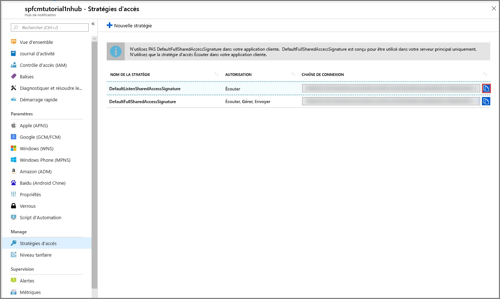

1. Connectez-vous au [portail Azure](https://portal.azure.com).

2. Sélectionnez **Nouveau** > **Web + Mobile** > **Notification Hub**.
   
      
      
3. Dans la zone **Hub de notification**, saisissez un nom unique. Sélectionnez votre **Région**, **Abonnement** et **Groupe de ressources** (si vous en avez déjà un). 
   
    Si vous disposez déjà d’un espace de noms Service Bus dans lequel vous voulez créer le hub, procédez comme suit :

    a. Dans la zone **Espace de noms**, sélectionnez le lien **Sélectionner un existant**. 
   
    b. Sélectionnez **Créer**.

    Si vous ne disposez pas d’un espace de noms Service Bus, vous pouvez utiliser le nom par défaut, qui est créé à partir du nom du hub (si l’espace de noms est disponible).
   
      

    Une fois que vous avez créé l’espace de noms et le hub de notification, le portail Azure s’ouvre. 
   
      

4. Sélectionnez **Paramètres** > **Stratégies d’accès**. Notez les deux chaînes de connexion sont disponibles pour vous. Vous en aurez besoin pour gérer les notifications Push plus tard.
   
      

