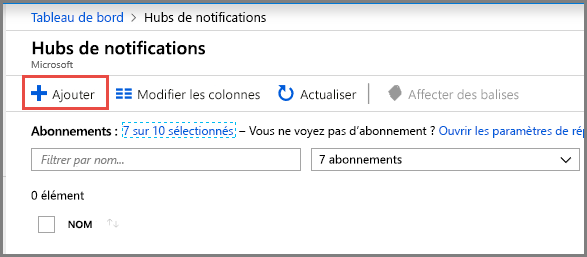

1. Connectez-vous au [Portail Azure](https://portal.azure.com).
2. Sélectionnez **Tous les services** dans le menu de gauche, puis sélectionnez **Notification Hubs** dans la section **Mobile**. Sélectionnez l’étoile (`*`) en regard du nom du service pour l’ajouter à la section **FAVORIS** dans le menu de gauche. Une fois que **Notification Hubs** est ajouté aux **FAVORIS**, sélectionnez-le dans le menu de gauche. 

      
3. Dans la page **Notification Hubs**, sélectionnez **Ajouter** dans la barre d’outils. 

      
4. Dans la page **Notification Hub**, effectuez les étapes suivantes : 
    1. Spécifiez un **nom** pour le **hub** de notification.  
    2. Spécifiez un **nom** pour l’**espace de noms**. Un espace de noms contient un ou plusieurs hubs. 
    3. Sélectionnez un **emplacement** dans lequel vous voulez créer le hub de notification. 
    4. Sélectionnez un groupe de ressources existant ou entrez un nom pour le nouveau **groupe de ressources**.
    5. Sélectionnez **Créer**. 

        
4. Sélectionnez **Notifications** (icône de cloche) puis **Accéder à la ressource**. Vous pouvez également actualiser la liste dans la page **Notification Hubs** et sélectionner votre hub de notification. 

      
5. Sélectionnez **Stratégies d’accès** dans la liste. Notez les deux chaînes de connexion sont disponibles pour vous. Vous en avez besoin pour gérer les notifications Push plus tard.

      >[!IMPORTANT]
      >N’utilisez **PAS** le DefaultFullSharedAccessSignature dans votre application. Il est prévu pour être utilisé uniquement dans votre serveur principal.
      >

      
