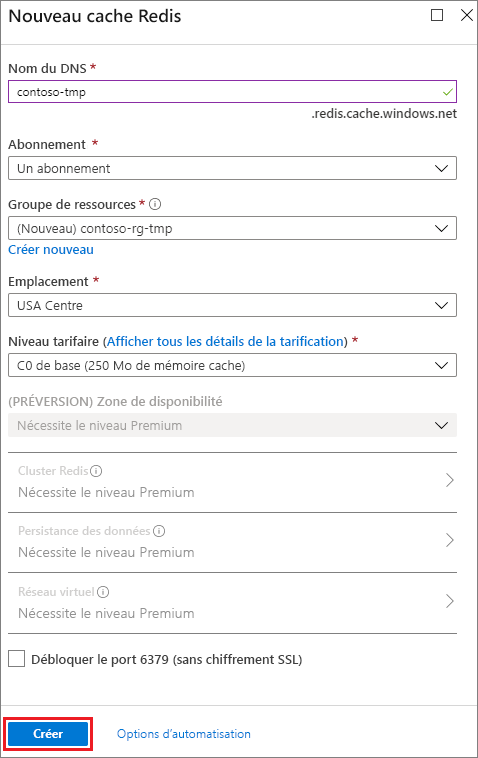

1. Pour créer un cache, connectez-vous au [portail Azure](https://portal.azure.com). Sélectionnez ensuite **Créer une ressource** > **Bases de données** > **Cache Azure pour Redis**.

    

2. Dans **Nouveau cache Azure pour Redis**, configurez les paramètres du nouveau cache.

    | Paramètre      | Valeur suggérée  | Description |
    | ------------ |  ------- | -------------------------------------------------- |
    | **Nom DNS** | Nom globalement unique | Le nom du cache. Il doit être une chaîne de 1 à 63 caractères et contenir uniquement des chiffres, des lettres et le caractère `-`. Le nom du cache ne peut ni commencer ni se terminer par le caractère `-` et il n’accepte pas de caractères `-` consécutifs.  | 
    | **Abonnement** | Votre abonnement | L’abonnement sous lequel est créée cette nouvelle instance de cache Azure pour Redis. | 
    | **Groupe de ressources** |  *TestResources* | Nom du nouveau groupe de ressources dans lequel créer votre cache. En plaçant toutes les ressources d’une application dans un groupe, vous pouvez les gérer ensemble. Par exemple, si vous supprimez le groupe de ressources, vous supprimez également toutes les ressources associées à l’application. | 
    | **Lieu** | USA Est | Choisissez une [région](https://azure.microsoft.com/regions/) à proximité des autres services qui utilisent votre cache. |
    | **[Niveau tarifaire](https://azure.microsoft.com/pricing/details/cache/)** |  De base C0 (cache de 250 Mo) |  Le niveau tarifaire détermine la taille, les performances et les fonctionnalités disponibles pour le cache. Pour plus d’informations, consultez [Présentation du cache Azure pour Redis](../articles/azure-cache-for-redis/cache-overview.md). |
    | **Épingler au tableau de bord** |  Volumes sélectionnés | Épinglez le nouveau cache à votre tableau de bord pour en faciliter la recherche. |

     

3. Une fois les paramètres du nouveau cache configurés, sélectionnez **Créer**. 

    La création du cache peut prendre plusieurs minutes. Pour vérifier l’état d’avancement de l’opération, vous pouvez consulter le tableau de bord. Après sa création, le nouveau cache indique l’état **En cours d’exécution**, et il est prêt à être utilisé.

    

