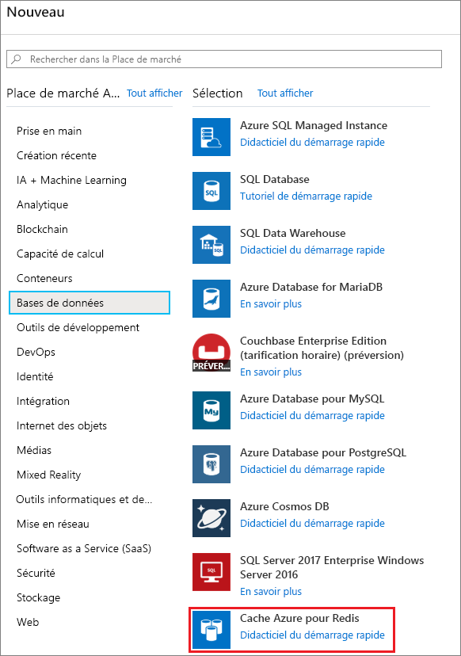

Pour créer un cache, connectez-vous au [portail Azure](https://portal.azure.com), puis cliquez sur **Nouveau**, **Données + stockage** et **Cache Redis**.

> [!NOTE]
> Si vous ne possédez pas de compte Azure, vous pouvez [ouvrir un compte Azure gratuitement](https://azure.microsoft.com/pricing/free-trial/?WT.mc_id=redis_cache_hero) en quelques minutes.
> 
> 

> [!NOTE]
> En plus de créer des caches dans le portail Azure, vous pouvez en créer à l’aide de modèles Resource Manager, PowerShell ou Azure CLI.
> 
> * Pour créer un cache à l’aide de modèles Resource Manager, voir [Créer un cache Redis à l’aide d’un modèle](../articles/redis-cache/cache-redis-cache-arm-provision.md).
> * Pour créer un cache à l’aide d’Azure PowerShell, voir [Gestion du Cache Redis Azure avec Azure PowerShell](../articles/redis-cache/cache-howto-manage-redis-cache-powershell.md).
> * Pour créer un cache à l’aide de l’interface de ligne de commande Azure, voir [Création et gestion du cache Redis Azure à l’aide de l’interface de ligne de commande Azure (Azure CLI)](../articles/redis-cache/cache-manage-cli.md).
> 
> 

Dans le panneau **Nouveau cache Redis** , spécifiez la configuration souhaitée pour le cache.

 

* Dans **Nom DNS**, entrez le nom de cache à utiliser pour le point de terminaison du cache. Le nom du cache doit être une chaîne de 1 à 63 caractères et contenir uniquement des chiffres, des lettres et le caractère `-` . Le nom du cache ne peut ni commencer ni se terminer par le caractère `-` et il n’accepte pas de caractères `-` consécutifs.
* Dans **Abonnement**, sélectionnez l’abonnement Azure que vous voulez utiliser pour le cache. Si votre compte a un seul abonnement, il sera automatiquement sélectionné et la liste déroulante **Abonnement** ne sera pas affichée.
* Dans **Groupe de ressources**, sélectionnez ou créez un groupe de ressources pour le cache. Pour plus d'informations, consultez la rubrique [Utilisation des groupes de ressources pour gérer vos ressources Azure](../articles/azure-resource-manager/resource-group-overview.md). 
* Utilisez la **Emplacement** pour indiquer l’emplacement géographique de l’hébergement de votre cache. Pour des performances optimales, Microsoft recommande de créer le cache dans la même région que l'application cliente du cache.
* Utilisez **Option de tarification** pour sélectionner la taille du cache et les fonctionnalités appropriées.
* **cluster Redis** vous permet de créer des caches supérieurs à 53 Go et de partitionner les données sur plusieurs nœuds Redis. Pour plus d’informations, consultez [Comment configurer le clustering Redis pour un Cache Redis Azure Premium](../articles/redis-cache/cache-how-to-premium-clustering.md).
* **persistance Redis** offre la possibilité de rendre votre cache persistant dans un compte de stockage Azure. Pour obtenir des instructions sur la configuration de la persistance, consultez [Comment configurer la persistance pour un Cache Redis Azure Premium](../articles/redis-cache/cache-how-to-premium-persistence.md).
* **réseau virtuel** provides enhanced security and isolation by restricting access to your cache to only those clients within the specified Azure réseau virtuel. Vous pouvez utiliser toutes les fonctionnalités de VNet, comme les sous-réseaux, les stratégies de contrôle d’accès et d’autres fonctionnalités pour améliorer la restriction d’accès à Redis. Pour plus d’informations, consultez [Comment configurer la prise en charge des réseaux virtuels pour un cache Redis Azure Premium](../articles/redis-cache/cache-how-to-premium-vnet.md).

Une fois les options du nouveau cache configurées, cliquez sur **Créer**. La création du cache peut prendre plusieurs minutes. Pour vérifier l'état d'avancement de l'opération, vous pouvez consulter le tableau d'accueil. Après sa création, le nouveau cache a le statut **En cours d’exécution** et il est prêt à fonctionner avec les [paramètres par défaut](../articles/redis-cache/cache-configure.md#default-redis-server-configuration).

<!--HONumber=Nov16_HO2-->

