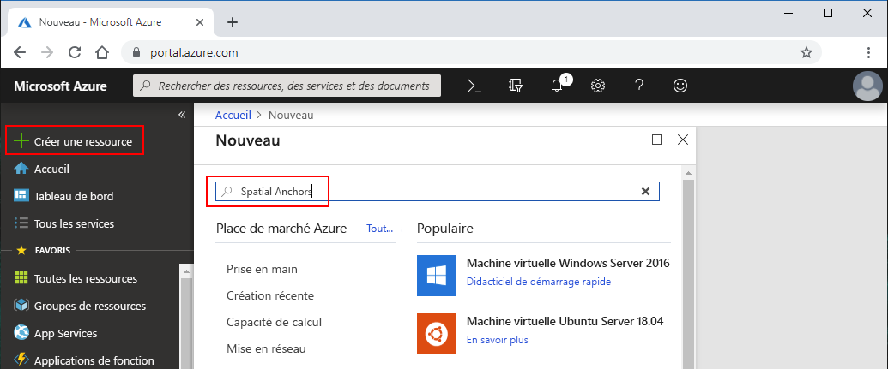
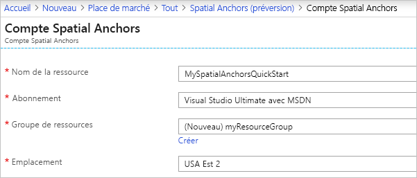
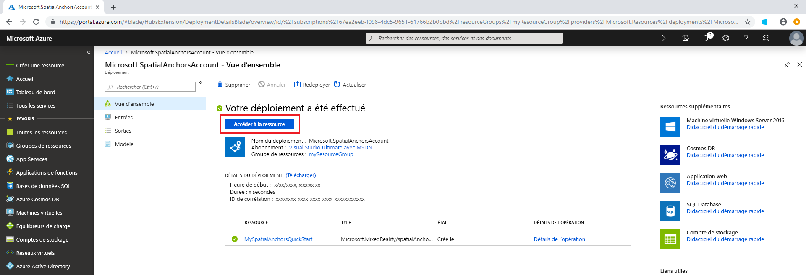

## Créer une ressource Spatial Anchors

Accédez au <a href="https://portal.azure.com" target="_blank">portail Azure</a>.

Dans le volet de navigation gauche du portail Azure, sélectionnez **Créer une ressource**.

Utilisez la zone de recherche pour rechercher **Spatial Anchors**.

   

Sélectionnez **Spatial Anchors**. Dans la boîte de dialogue, sélectionnez **Créer**.

Dans la boîte de dialogue **Compte Spatial Anchors** :

- Entrez un nom de ressource unique, en utilisant des caractères alphanumériques normaux.
- Sélectionnez l’abonnement auquel attacher la ressource.
- Créer un groupe de ressources en sélectionnant **Créer**. Nommez-le **myResourceGroup** et sélectionnez **OK**.
      [!INCLUDE [resource group intro text](resource-group.md)]
- Sélectionnez un emplacement (région) où placer la ressource.
- Sélectionnez **Nouveau** pour commencer à créer la ressource.

   

Une fois la ressource créée, le portail Azure indique que votre déploiement est terminé. Cliquez sur **Accéder à la ressource**.

Ensuite, vous pouvez afficher les propriétés de la ressource. Copiez l’**ID de compte** de la ressource dans un éditeur de texte, car vous en aurez besoin par la suite.

   

Sous **Paramètres**, sélectionnez **Clé**. Copiez la valeur de la **Clé primaire** dans un éditeur de texte. Cette valeur est la `Account Key`. Vous en aurez besoin ultérieurement.

   
