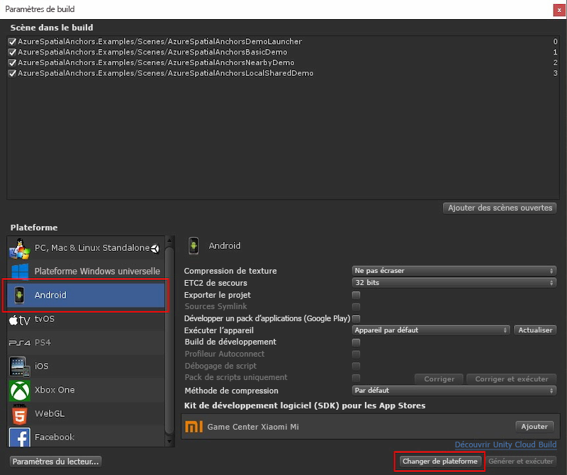

Dans Unity, ouvrez le projet du dossier `Unity`.

Ouvrez **Build Settings** (Paramètres de build) en sélectionnant **File** (Fichier) > **Build Settings** (Paramètres de build).

Dans la section **Platform**, sélectionnez **Android**. Remplacez le **système de build** par **Gradle** et sélectionnez **Export Project**.

Sélectionnez **Switch Platform** (Changer de plateforme) pour passer à la plateforme **Android**. Unity peut vous demander d’installer des composants de prise en charge Android s’ils sont manquants.

Fermez la fenêtre **Build Settings**.

### Télécharger et importer le kit SDK ARCore pour Unity

Téléchargez le fichier `unitypackage` à partir des [Mises en production du kit SDK ARCore pour Unity](https://github.com/google-ar/arcore-unity-sdk/releases/tag/v1.5.0). De retour dans le projet Unity, sélectionnez **Assets** (Ressources) > **Import Package** > **Custom Package**, puis sélectionnez le fichier `unitypackage` que vous avez téléchargé précédemment. Dans la boîte de dialogue **Import Unity Package**, vérifiez que tous les fichiers sont sélectionnés avant de sélectionner **Import**.
