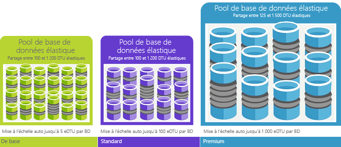

L'unité de transaction de base de données (DTU) est l'unité de mesure dans SQL Dtabase qui représente la puissance relative des bases de données selon une mesure réelle : la transaction de base de données. Nous avons étudié un ensemble d’opérations classiques pour une demande de traitement transactionnel en ligne, puis mesuré le nombre de transactions pouvant être effectuées par seconde dans des conditions de charge complète (ceci est la version courte, vous pouvez lire les détails dans [Vue d’ensemble des tests d’évaluation](../articles/sql-database/sql-database-benchmark-overview.md)).

Une base de données de base comprend 5 DTU, ce qui signifie qu'elle peut effectuer 5 transactions par seconde, alors qu'une base de données Premium P11 comprend 1 750 DTU.

La DTU pour les bases de données uniques se traduit directement par l’eDTU pour les bases de données élastiques. Par exemple, une base de données dans un pool de bases de données élastiques de base présente jusqu’à 5 eDTU. Ce sont les mêmes performances qu’avec une base de données de base unique. La différence est que la base de données élastique n’utilise pas d’eDTU du pool tant qu’elle n’y est pas obligée.

Voici un exemple simple pour mieux comprendre. Prenons un pool de bases de données élastiques de base avec 1 000 DTU et déposons 800 bases de données dans ce pool. Tant qu'il n'y a pas plus de 200 bases de données sur les 800 qui sont utilisées à n'importe quel moment (5 DTU X 200 = 1 000), vous n'atteignez pas le seuil de capacité du pool et les performances de la base de données ne sont pas affectées. Cet exemple est simplifié à des fins de clarté. Le calcul mathématique réel est un peu plus complexe. Le portail effectue le calcul pour vous et émet une recommandation basée sur l’utilisation historique de la base de données. Consultez [Considérations sur les prix et performances pour un pool de bases de données élastique](../articles/sql-database/sql-database-elastic-pool-guidance.md) pour comprendre le fonctionnement des recommandations ou effectuer les calculs vous-même.

<!---HONumber=Nov15_HO1-->