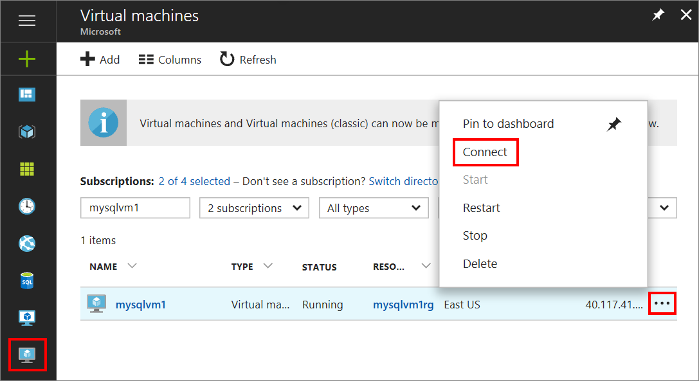
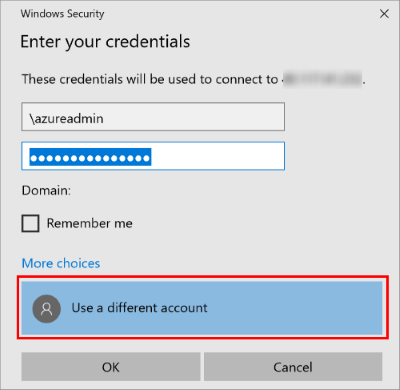

Pour vous connecter à la machine virtuelle SQL Server à l’aide du Bureau à distance, procédez comme suit.

1. Une fois la machine virtuelle créée et en cours d’exécution, cliquez sur l’icône Machines virtuelles dans le portail Azure pour visualiser vos machines virtuelles.

1. Cliquez sur les points de suspension, **...**, en regard de votre nouvelle machine virtuelle.

1. Cliquez sur **Connecter**.

   

1. Ouvrez le fichier **RDP** que votre navigateur télécharge pour la machine virtuelle.

1. La connexion Bureau à distance vous informe que le serveur de publication de cette connexion à distance n’est pas identifiable. Cliquez sur **Connect** pour continuer.

1. Dans la boîte de dialogue **Sécurité de Windows**, cliquez sur **Utiliser un autre compte**. Vous pouvez avoir besoin de cliquer sur **Autres choix** pour voir cette option. Spécifiez le nom d’utilisateur et le mot de passe que vous avez configurés lorsque vous avez créé la machine virtuelle. Vous devez ajouter une barre oblique inverse avant le nom d’utilisateur.

   

Une fois que vous vous connectez à la machine virtuelle SQL Server, vous pouvez lancer SQL Server Management Studio et vous connecter avec l’authentification Windows à l’aide de vos informations d’identification d’administrateur local. Si vous avez activé l’authentification SQL Server, vous pouvez également vous connecter avec l’authentification SQL à l’aide de la connexion SQL et du mot de passe configuré lors de l’approvisionnement.

L’accès à la machine permet de modifier directement les paramètres SQL Server et ceux de la machine en fonction de vos besoins. Par exemple, vous pourriez configurer les paramètres du pare-feu ou modifier les paramètres de configuration SQL Server.